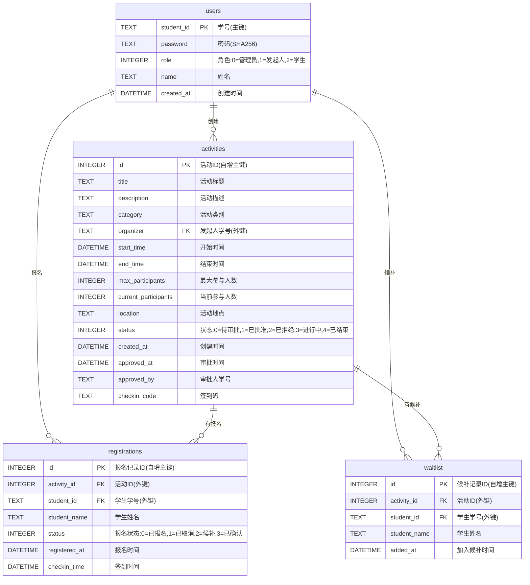

# 数据库E-R图（Mermaid格式）

## 实体关系图

## 关系说明

1. **users → activities** (1:N)
   - 一个用户可以创建多个活动
   - 关系字段：activities.organizer → users.student_id

2. **activities → registrations** (1:N)
   - 一个活动可以有多个报名记录
   - 关系字段：registrations.activity_id → activities.id
   - 约束：ON DELETE CASCADE（删除活动时自动删除报名记录）

3. **users → registrations** (1:N)
   - 一个用户可以报名多个活动
   - 关系字段：registrations.student_id → users.student_id
   - 约束：UNIQUE(activity_id, student_id)（一个学生只能报名一次同一活动）

4. **activities → waitlist** (1:N)
   - 一个活动可以有多个候补记录
   - 关系字段：waitlist.activity_id → activities.id
   - 约束：ON DELETE CASCADE

5. **users → waitlist** (1:N)
   - 一个用户可以在多个活动的候补列表中
   - 关系字段：waitlist.student_id → users.student_id
   - 约束：UNIQUE(activity_id, student_id)

## 索引说明

- **users表**：主键索引 student_id（自动创建）
- **activities表**：
  - 主键索引：id（自动创建）
  - 普通索引：status（idx_activities_status），用于快速查询特定状态的活动
- **registrations表**：
  - 主键索引：id（自动创建）
  - 普通索引：activity_id（idx_registrations_activity）
  - 普通索引：student_id（idx_registrations_student）
- **waitlist表**：
  - 主键索引：id（自动创建）
  - 普通索引：activity_id（idx_waitlist_activity）
