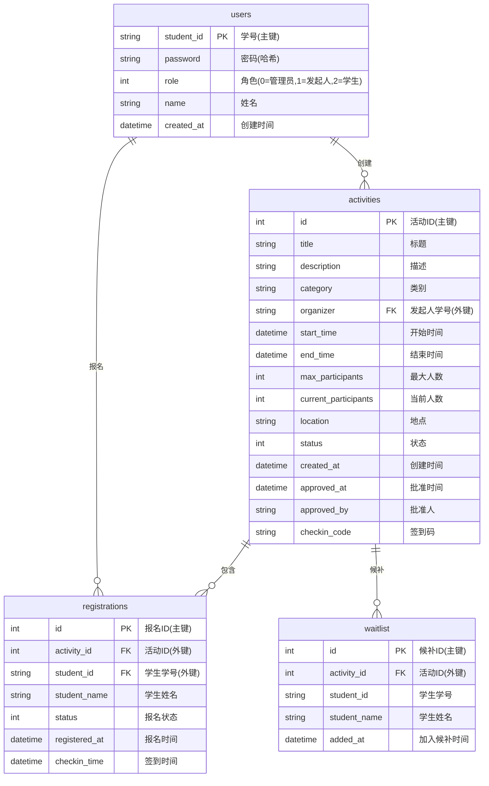
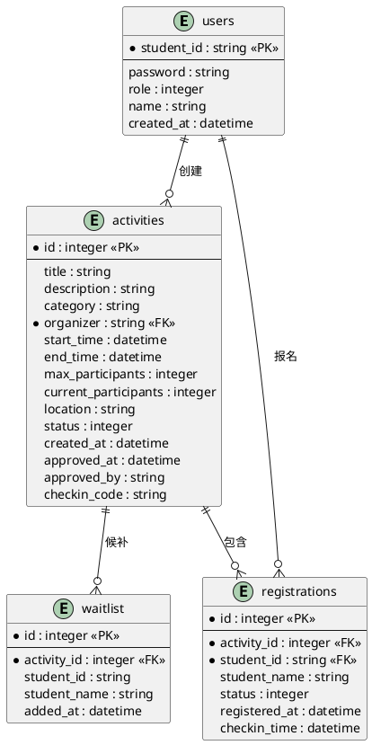

# E-R图在线生成指南

本文档提供多种在线生成E-R图的方法，适用于校园活动报名与签到管理系统的数据库设计。

---

## 方法一：使用 Mermaid 在线编辑器（推荐）

### 优点
- ✅ 完全免费
- ✅ 支持代码直接渲染
- ✅ 可导出为PNG/SVG
- ✅ 代码可嵌入Markdown文档

### 使用步骤

1. **访问 Mermaid Live Editor**
   - 网址：https://mermaid.live/
   - 或：https://mermaid.ink/

2. **粘贴以下代码**：



3. **查看和导出**
   - 左侧编辑代码，右侧实时预览
   - 点击右上角 "Actions" → "Download PNG" 或 "Download SVG"
   - 或点击 "Copy PNG" 直接复制图片

---

## 方法二：使用 Draw.io (diagrams.net)

### 优点
- ✅ 功能强大，支持多种图表类型
- ✅ 可导出多种格式
- ✅ 支持云存储（Google Drive, OneDrive）
- ✅ 完全免费

### 使用步骤

1. **访问 Draw.io**
   - 网址：https://app.diagrams.net/
   - 或：https://www.draw.io/

2. **创建新图表**
   - 选择 "Create New Diagram"
   - 选择 "Entity Relationship" 模板
   - 或选择空白图表

3. **绘制实体**
   - 从左侧工具栏拖拽 "Entity" 形状
   - 双击编辑实体名称（如：users, activities）
   - 添加属性字段

4. **建立关系**
   - 使用 "Relationship" 连接线连接实体
   - 设置关系类型（1:1, 1:N, N:M）
   - 添加关系标签

5. **导出图片**
   - File → Export as → PNG/JPG/SVG/PDF

### 快速操作提示
- **添加实体**：左侧工具栏 → Entity
- **添加关系**：左侧工具栏 → Relationship
- **设置关系基数**：选中连接线 → 右侧属性面板设置
- **美化样式**：Format → Style 调整颜色、字体等

---

## 方法三：使用 dbdiagram.io

### 优点
- ✅ 专为数据库设计
- ✅ 语法简洁
- ✅ 自动生成关系
- ✅ 支持导出SQL

### 使用步骤

1. **访问 dbdiagram.io**
   - 网址：https://dbdiagram.io/

2. **粘贴以下代码**：

```dbml
Table users {
  student_id string [primary key]
  password string
  role integer
  name string
  created_at datetime
}

Table activities {
  id integer [primary key]
  title string
  description string
  category string
  organizer string
  start_time datetime
  end_time datetime
  max_participants integer
  current_participants integer
  location string
  status integer
  created_at datetime
  approved_at datetime
  approved_by string
  checkin_code string
}

Table registrations {
  id integer [primary key]
  activity_id integer
  student_id string
  student_name string
  status integer
  registered_at datetime
  checkin_time datetime
}

Table waitlist {
  id integer [primary key]
  activity_id integer
  student_id string
  student_name string
  added_at datetime
}

Ref: activities.organizer > users.student_id
Ref: registrations.activity_id > activities.id
Ref: registrations.student_id > users.student_id
Ref: waitlist.activity_id > activities.id
```

3. **查看和导出**
   - 自动生成E-R图
   - 点击 "Export" → "PNG" 或 "PDF"
   - 可导出SQL脚本

---

## 方法四：使用 Lucidchart

### 优点
- ✅ 专业级图表工具
- ✅ 丰富的模板库
- ✅ 协作功能强大
- ⚠️ 免费版功能有限

### 使用步骤

1. **访问 Lucidchart**
   - 网址：https://www.lucidchart.com/
   - 需要注册账号（免费）

2. **创建E-R图**
   - 选择 "Entity Relationship Diagram" 模板
   - 或从空白开始

3. **绘制图表**
   - 拖拽实体和关系
   - 设置属性和基数

4. **导出**
   - File → Export → PNG/PDF/SVG

---

## 方法五：使用 PlantUML（代码生成）

### 优点
- ✅ 纯文本描述
- ✅ 版本控制友好
- ✅ 可集成到文档中

### 使用步骤

1. **访问 PlantUML 在线编辑器**
   - 网址：http://www.plantuml.com/plantuml/uml/
   - 或：https://plantuml-editor.kkeisuke.com/

2. **粘贴以下代码**：



3. **生成图片**
   - 点击 "Submit" 生成图片
   - 右键保存图片

---

## 推荐方案对比

| 工具 | 易用性 | 功能 | 导出格式 | 推荐度 |
|------|--------|------|----------|--------|
| **Mermaid Live** | ⭐⭐⭐⭐⭐ | ⭐⭐⭐⭐ | PNG/SVG | ⭐⭐⭐⭐⭐ |
| **Draw.io** | ⭐⭐⭐⭐ | ⭐⭐⭐⭐⭐ | 多种格式 | ⭐⭐⭐⭐⭐ |
| **dbdiagram.io** | ⭐⭐⭐⭐⭐ | ⭐⭐⭐⭐ | PNG/PDF/SQL | ⭐⭐⭐⭐ |
| **Lucidchart** | ⭐⭐⭐ | ⭐⭐⭐⭐⭐ | 多种格式 | ⭐⭐⭐ |
| **PlantUML** | ⭐⭐⭐ | ⭐⭐⭐⭐ | PNG/SVG | ⭐⭐⭐ |

---

## 快速生成步骤（推荐：Mermaid）

### 最简单的方法：

1. 打开 https://mermaid.live/
2. 复制文档中的 Mermaid E-R 图代码
3. 粘贴到编辑器
4. 点击 "Actions" → "Download PNG"
5. 完成！

### 或者直接在 Markdown 中查看：

如果使用支持 Mermaid 的 Markdown 编辑器（如 Typora、VS Code + 扩展），可以直接在文档中查看渲染后的图表。

---

## 注意事项

1. **关系表示**：
   - `||--o{` 表示一对多（1:N）
   - `||--||` 表示一对一（1:1）
   - `}o--o{` 表示多对多（N:M）

2. **字段类型**：
   - PK = Primary Key（主键）
   - FK = Foreign Key（外键）

3. **导出质量**：
   - PNG：适合文档插入
   - SVG：矢量图，可无损缩放
   - PDF：适合打印

---

## 示例：完整的 Mermaid E-R 图代码

已包含在 `系统设计文档.md` 的 2.3.1 节中，可直接复制使用。

