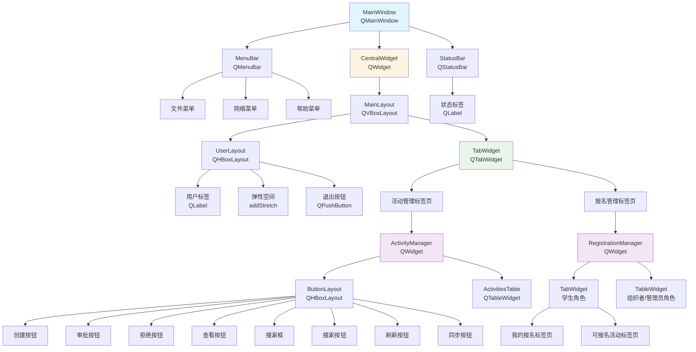
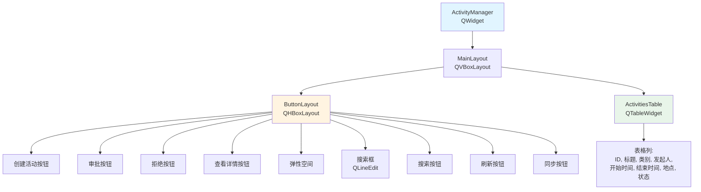
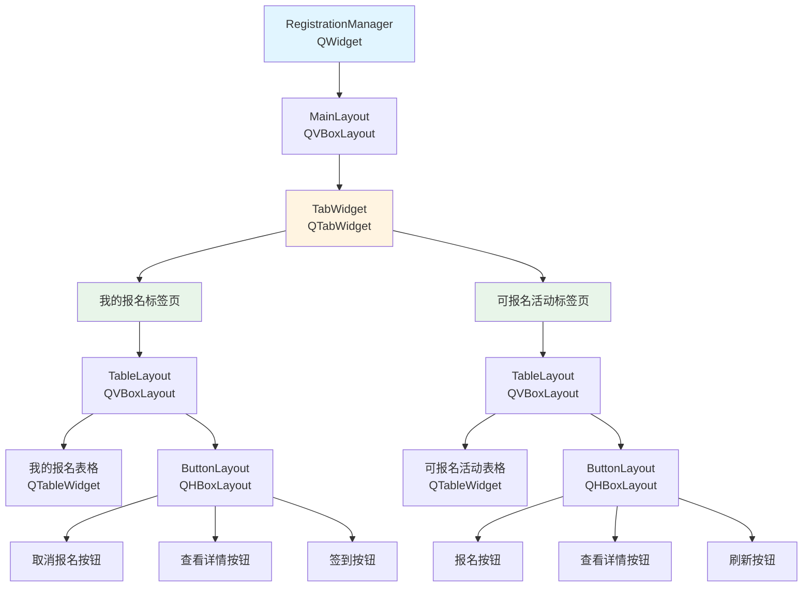
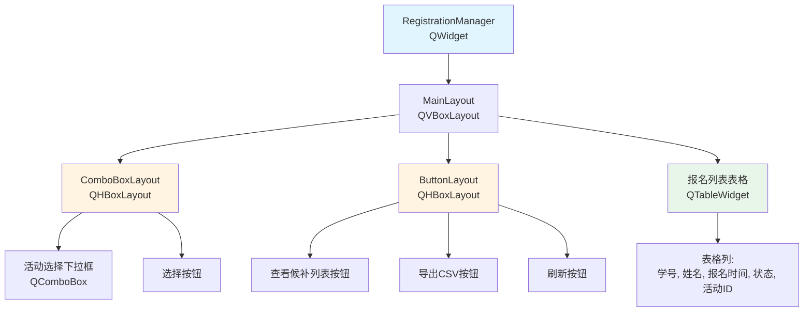
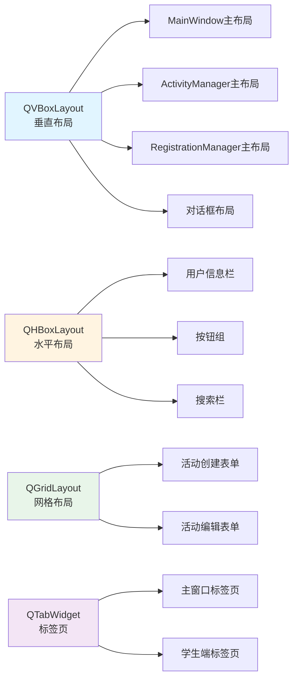
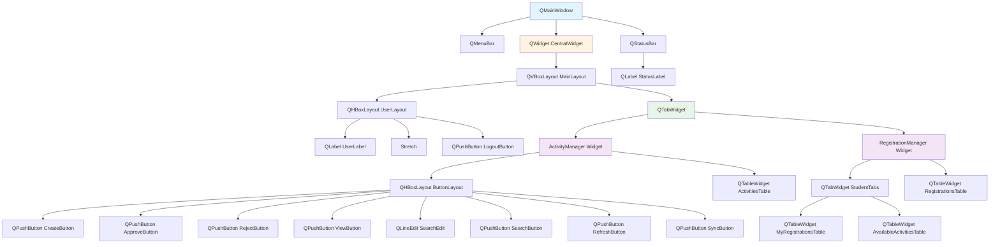
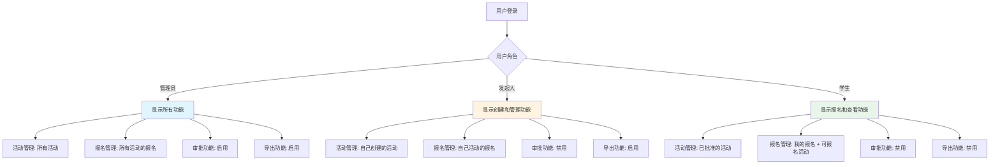

# UI布局图（Mermaid格式）

## 主界面布局结构图

```mermaid
graph TB
    A[MainWindow<br/>QMainWindow] --> B[MenuBar<br/>QMenuBar]
    A --> C[CentralWidget<br/>QWidget]
    A --> D[StatusBar<br/>QStatusBar]
    
    B --> B1[文件菜单]
    B --> B2[网络菜单]
    B --> B3[帮助菜单]
    
    C --> E[MainLayout<br/>QVBoxLayout]
    
    E --> F[UserLayout<br/>QHBoxLayout]
    E --> G[TabWidget<br/>QTabWidget]
    
    F --> F1[用户标签<br/>QLabel]
    F --> F2[弹性空间<br/>addStretch]
    F --> F3[退出按钮<br/>QPushButton]
    
    G --> G1[活动管理标签页]
    G --> G2[报名管理标签页]
    
    G1 --> H1[ActivityManager<br/>QWidget]
    G2 --> H2[RegistrationManager<br/>QWidget]
    
    H1 --> I1[ButtonLayout<br/>QHBoxLayout]
    H1 --> I2[ActivitiesTable<br/>QTableWidget]
    
    I1 --> I1A[创建按钮]
    I1 --> I1B[审批按钮]
    I1 --> I1C[拒绝按钮]
    I1 --> I1D[查看按钮]
    I1 --> I1E[搜索框]
    I1 --> I1F[搜索按钮]
    I1 --> I1G[刷新按钮]
    I1 --> I1H[同步按钮]
    
    H2 --> J1[TabWidget<br/>学生角色]
    H2 --> J2[TableWidget<br/>组织者/管理员角色]
    
    J1 --> J1A[我的报名标签页]
    J1 --> J1B[可报名活动标签页]
    
    D --> D1[状态标签<br/>QLabel]
    
    style A fill:#e1f5ff
    style C fill:#fff4e1
    style G fill:#e8f5e9
    style H1 fill:#f3e5f5
    style H2 fill:#f3e5f5
```

## 活动管理页面布局

```mermaid
graph TB
    A[ActivityManager<br/>QWidget] --> B[MainLayout<br/>QVBoxLayout]
    
    B --> C[ButtonLayout<br/>QHBoxLayout]
    B --> D[ActivitiesTable<br/>QTableWidget]
    
    C --> C1[创建活动按钮]
    C --> C2[审批按钮]
    C --> C3[拒绝按钮]
    C --> C4[查看详情按钮]
    C --> C5[弹性空间]
    C --> C6[搜索框<br/>QLineEdit]
    C --> C7[搜索按钮]
    C --> C8[刷新按钮]
    C --> C9[同步按钮]
    
    D --> D1[表格列:<br/>ID, 标题, 类别, 发起人,<br/>开始时间, 结束时间, 地点, 状态]
    
    style A fill:#e1f5ff
    style C fill:#fff4e1
    style D fill:#e8f5e9
```

## 报名管理页面布局（学生角色）

```mermaid
graph TB
    A[RegistrationManager<br/>QWidget] --> B[MainLayout<br/>QVBoxLayout]
    
    B --> C[TabWidget<br/>QTabWidget]
    
    C --> D[我的报名标签页]
    C --> E[可报名活动标签页]
    
    D --> D1[TableLayout<br/>QVBoxLayout]
    D1 --> D2[我的报名表格<br/>QTableWidget]
    D1 --> D3[ButtonLayout<br/>QHBoxLayout]
    D3 --> D4[取消报名按钮]
    D3 --> D5[查看详情按钮]
    D3 --> D6[签到按钮]
    
    E --> E1[TableLayout<br/>QVBoxLayout]
    E1 --> E2[可报名活动表格<br/>QTableWidget]
    E1 --> E3[ButtonLayout<br/>QHBoxLayout]
    E3 --> E4[报名按钮]
    E3 --> E5[查看详情按钮]
    E3 --> E6[刷新按钮]
    
    style A fill:#e1f5ff
    style C fill:#fff4e1
    style D fill:#e8f5e9
    style E fill:#e8f5e9
```

## 报名管理页面布局（组织者/管理员角色）

```mermaid
graph TB
    A[RegistrationManager<br/>QWidget] --> B[MainLayout<br/>QVBoxLayout]
    
    B --> C[ComboBoxLayout<br/>QHBoxLayout]
    C --> C1[活动选择下拉框<br/>QComboBox]
    C --> C2[选择按钮]
    
    B --> D[ButtonLayout<br/>QHBoxLayout]
    D --> D1[查看候补列表按钮]
    D --> D2[导出CSV按钮]
    D --> D3[刷新按钮]
    
    B --> E[报名列表表格<br/>QTableWidget]
    E --> E1[表格列:<br/>学号, 姓名, 报名时间, 状态, 活动ID]
    
    style A fill:#e1f5ff
    style C fill:#fff4e1
    style D fill:#fff4e1
    style E fill:#e8f5e9
```

## 布局管理器使用关系图

```mermaid
graph LR
    A[QVBoxLayout<br/>垂直布局] --> A1[MainWindow主布局]
    A --> A2[ActivityManager主布局]
    A --> A3[RegistrationManager主布局]
    A --> A4[对话框布局]
    
    B[QHBoxLayout<br/>水平布局] --> B1[用户信息栏]
    B --> B2[按钮组]
    B --> B3[搜索栏]
    
    C[QGridLayout<br/>网格布局] --> C1[活动创建表单]
    C --> C2[活动编辑表单]
    
    D[QTabWidget<br/>标签页] --> D1[主窗口标签页]
    D --> D2[学生端标签页]
    
    style A fill:#e1f5ff
    style B fill:#fff4e1
    style C fill:#e8f5e9
    style D fill:#f3e5f5
```

## UI组件层次结构

```mermaid
graph TD
    A[QMainWindow] --> B[QMenuBar]
    A --> C[QWidget CentralWidget]
    A --> D[QStatusBar]
    
    C --> E[QVBoxLayout MainLayout]
    
    E --> F[QHBoxLayout UserLayout]
    E --> G[QTabWidget]
    
    F --> F1[QLabel UserLabel]
    F --> F2[Stretch]
    F --> F3[QPushButton LogoutButton]
    
    G --> G1[ActivityManager Widget]
    G --> G2[RegistrationManager Widget]
    
    G1 --> H1[QHBoxLayout ButtonLayout]
    G1 --> H2[QTableWidget ActivitiesTable]
    
    H1 --> H1A[QPushButton CreateButton]
    H1 --> H1B[QPushButton ApproveButton]
    H1 --> H1C[QPushButton RejectButton]
    H1 --> H1D[QPushButton ViewButton]
    H1 --> H1E[QLineEdit SearchEdit]
    H1 --> H1F[QPushButton SearchButton]
    H1 --> H1G[QPushButton RefreshButton]
    H1 --> H1H[QPushButton SyncButton]
    
    G2 --> I1[QTabWidget StudentTabs]
    G2 --> I2[QTableWidget RegistrationsTable]
    
    I1 --> I1A[QTableWidget MyRegistrationsTable]
    I1 --> I1B[QTableWidget AvailableActivitiesTable]
    
    D --> D1[QLabel StatusLabel]
    
    style A fill:#e1f5ff
    style C fill:#fff4e1
    style G fill:#e8f5e9
    style G1 fill:#f3e5f5
    style G2 fill:#f3e5f5
```

## 角色驱动的UI显示逻辑

```mermaid
flowchart TD
    A[用户登录] --> B{用户角色}
    
    B -->|管理员| C[显示所有功能]
    B -->|发起人| D[显示创建和管理功能]
    B -->|学生| E[显示报名和查看功能]
    
    C --> C1[活动管理: 所有活动]
    C --> C2[报名管理: 所有活动的报名]
    C --> C3[审批功能: 启用]
    C --> C4[导出功能: 启用]
    
    D --> D1[活动管理: 自己创建的活动]
    D --> D2[报名管理: 自己活动的报名]
    D --> D3[审批功能: 禁用]
    D --> D4[导出功能: 启用]
    
    E --> E1[活动管理: 已批准的活动]
    E --> E2[报名管理: 我的报名 + 可报名活动]
    E --> E3[审批功能: 禁用]
    E --> E4[导出功能: 禁用]
    
    style C fill:#e1f5ff
    style D fill:#fff4e1
    style E fill:#e8f5e9
```
