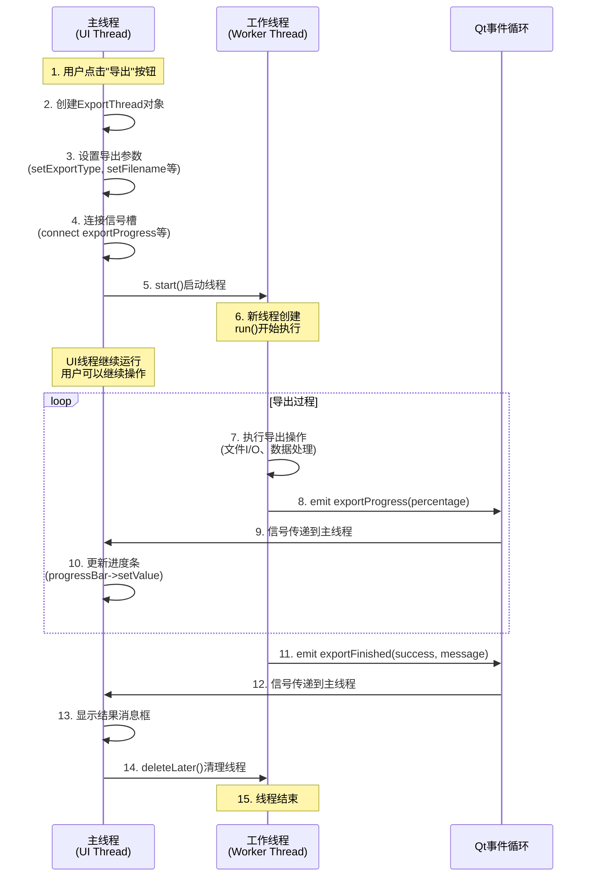
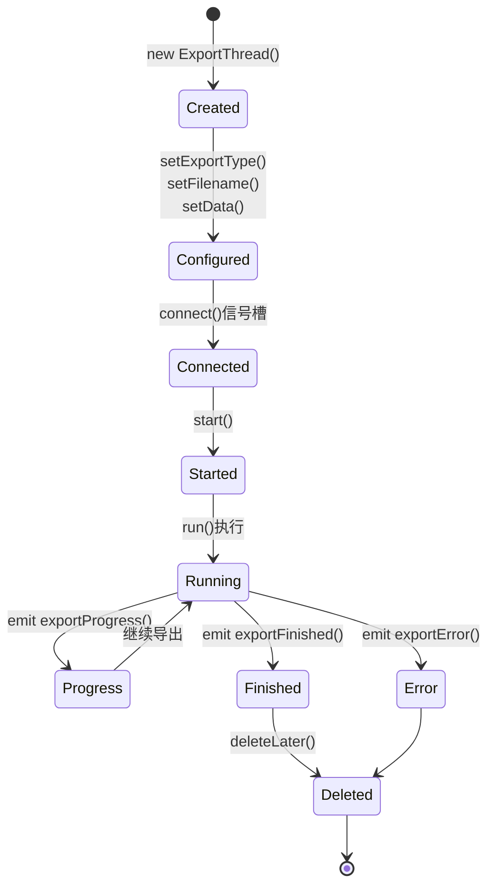
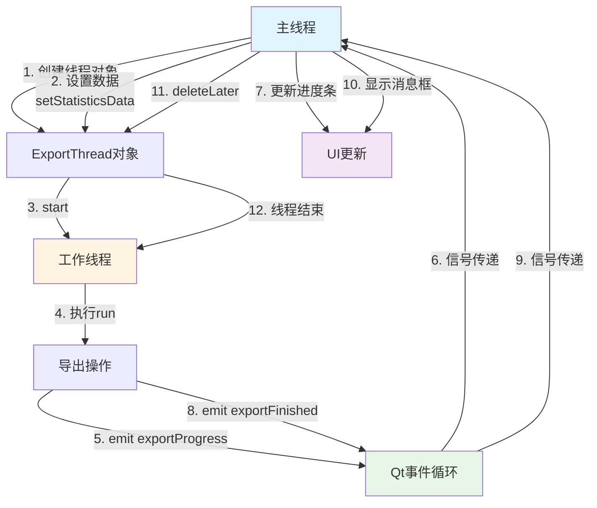
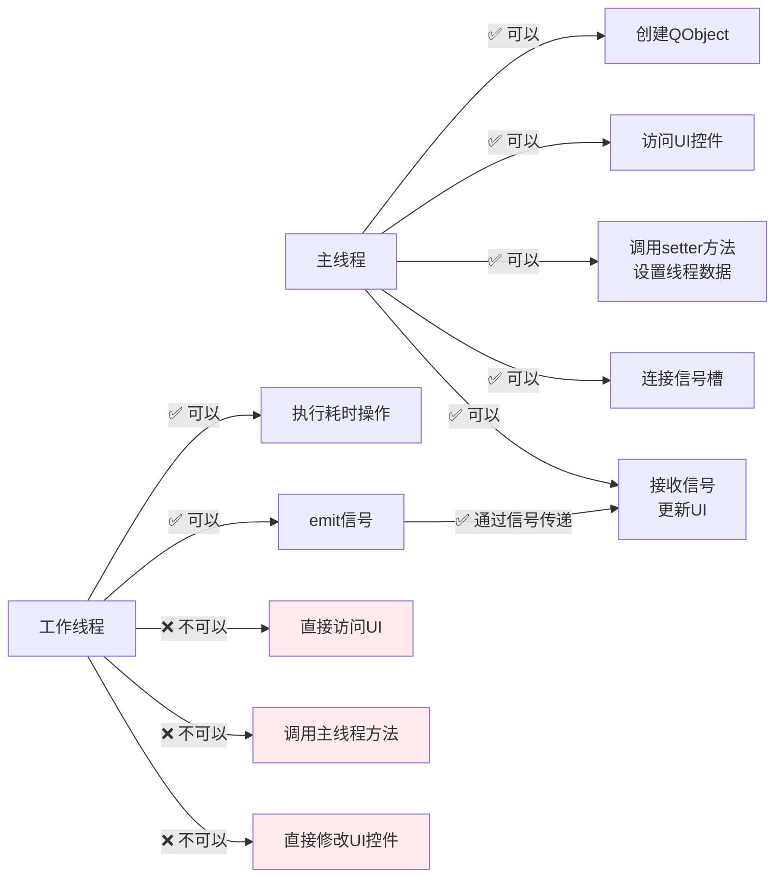
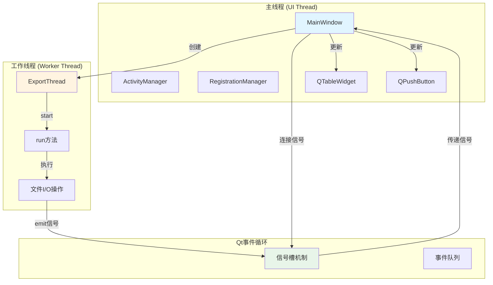
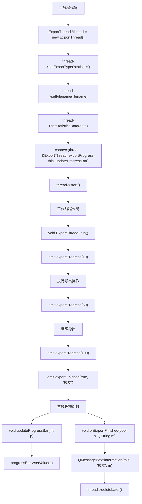

# 多线程通信流程图（Mermaid格式）

## 线程与UI通信流程图

```mermaid
sequenceDiagram
    participant UI as 主线程<br/>(UI Thread)
    participant Thread as 工作线程<br/>(Worker Thread)
    participant EventLoop as Qt事件循环
    
    Note over UI: 1. 用户点击"导出"按钮
    
    UI->>UI: 2. 创建ExportThread对象
    UI->>UI: 3. 设置导出参数<br/>(setExportType, setFilename等)
    UI->>UI: 4. 连接信号槽<br/>(connect exportProgress等)
    
    UI->>Thread: 5. start()启动线程
    Note over Thread: 6. 新线程创建<br/>run()开始执行
    
    Note over UI: UI线程继续运行<br/>用户可以继续操作
    
    loop 导出过程
        Thread->>Thread: 7. 执行导出操作<br/>(文件I/O、数据处理)
        Thread->>EventLoop: 8. emit exportProgress(percentage)
        EventLoop->>UI: 9. 信号传递到主线程
        UI->>UI: 10. 更新进度条<br/>(progressBar->setValue)
    end
    
    Thread->>EventLoop: 11. emit exportFinished(success, message)
    EventLoop->>UI: 12. 信号传递到主线程
    UI->>UI: 13. 显示结果消息框
    UI->>Thread: 14. deleteLater()清理线程
    
    Note over Thread: 15. 线程结束
```

## 线程生命周期图

```mermaid
stateDiagram-v2
    [*] --> Created: new ExportThread()
    Created --> Configured: setExportType()<br/>setFilename()<br/>setData()
    Configured --> Connected: connect()信号槽
    Connected --> Started: start()
    
    Started --> Running: run()执行
    Running --> Progress: emit exportProgress()
    Progress --> Running: 继续导出
    Running --> Finished: emit exportFinished()
    
    Finished --> Deleted: deleteLater()
    Deleted --> [*]
    
    Running --> Error: emit exportError()
    Error --> Deleted
```

## 数据流向图

```mermaid
flowchart TD
    A[主线程] -->|1. 创建线程对象| B[ExportThread对象]
    A -->|2. 设置数据<br/>setStatisticsData| B
    
    B -->|3. start| C[工作线程]
    
    C -->|4. 执行run| D[导出操作]
    D -->|5. emit exportProgress| E[Qt事件循环]
    E -->|6. 信号传递| A
    A -->|7. 更新进度条| F[UI更新]
    
    D -->|8. emit exportFinished| E
    E -->|9. 信号传递| A
    A -->|10. 显示消息框| F
    
    A -->|11. deleteLater| B
    B -->|12. 线程结束| C
    
    style A fill:#e1f5ff
    style C fill:#fff4e1
    style E fill:#e8f5e9
    style F fill:#f3e5f5
```

## 线程安全规则图

```mermaid
flowchart LR
    A[主线程] -->|✅ 可以| B[创建QObject]
    A -->|✅ 可以| C[访问UI控件]
    A -->|✅ 可以| D[调用setter方法<br/>设置线程数据]
    A -->|✅ 可以| E[连接信号槽]
    A -->|✅ 可以| F[接收信号<br/>更新UI]
    
    G[工作线程] -->|✅ 可以| H[执行耗时操作]
    G -->|✅ 可以| I[emit信号]
    G -->|❌ 不可以| J[直接访问UI]
    G -->|❌ 不可以| K[调用主线程方法]
    G -->|❌ 不可以| L[直接修改UI控件]
    
    I -->|✅ 通过信号传递| F
    
    style J fill:#ffebee
    style K fill:#ffebee
    style L fill:#ffebee
```

## 多线程架构图

```mermaid
graph TB
    subgraph "主线程 (UI Thread)"
        A[MainWindow]
        B[ActivityManager]
        C[RegistrationManager]
        D[QTableWidget]
        E[QPushButton]
    end
    
    subgraph "工作线程 (Worker Thread)"
        F[ExportThread]
        G[run方法]
        H[文件I/O操作]
    end
    
    subgraph "Qt事件循环"
        I[信号槽机制]
        J[事件队列]
    end
    
    A -->|创建| F
    A -->|连接信号| I
    F -->|start| G
    G -->|执行| H
    H -->|emit信号| I
    I -->|传递信号| A
    A -->|更新| D
    A -->|更新| E
    
    style A fill:#e1f5ff
    style F fill:#fff4e1
    style I fill:#e8f5e9
```

## 线程通信示例代码流程

```mermaid
flowchart TD
    A[主线程代码] --> B["ExportThread *thread = new ExportThread()"]
    B --> C["thread->setExportType('statistics')"]
    C --> D["thread->setFilename(filename)"]
    D --> E["thread->setStatisticsData(data)"]
    E --> F["connect(thread, &ExportThread::exportProgress,<br/>this, updateProgressBar)"]
    F --> G["thread->start()"]
    
    G --> H[工作线程代码]
    H --> I["void ExportThread::run()"]
    I --> J["emit exportProgress(10)"]
    J --> K["执行导出操作"]
    K --> L["emit exportProgress(50)"]
    L --> M["继续导出"]
    M --> N["emit exportProgress(100)"]
    N --> O["emit exportFinished(true, '成功')"]
    
    O --> P[主线程槽函数]
    P --> Q["void updateProgressBar(int p)"]
    Q --> R["progressBar->setValue(p)"]
    
    P --> S["void onExportFinished(bool s, QString m)"]
    S --> T["QMessageBox::information(this, '成功', m)"]
    T --> U["thread->deleteLater()"]
```
