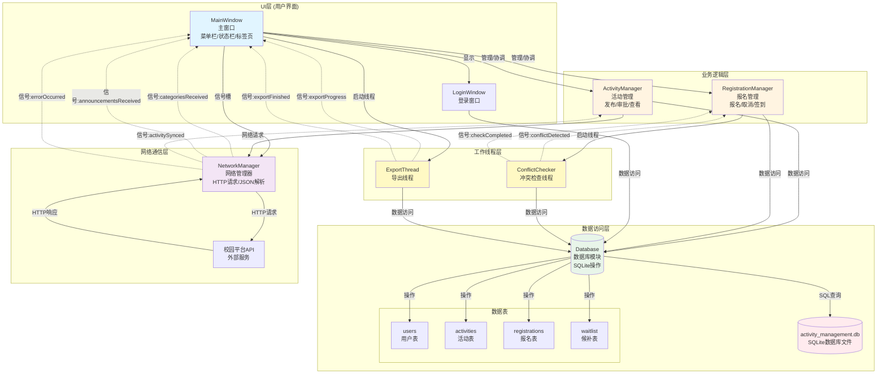
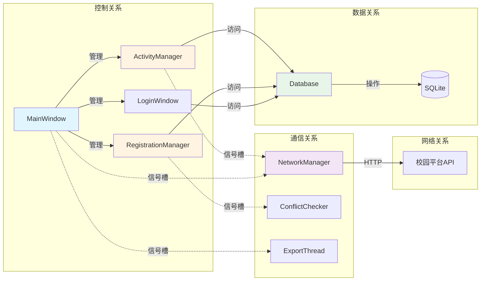
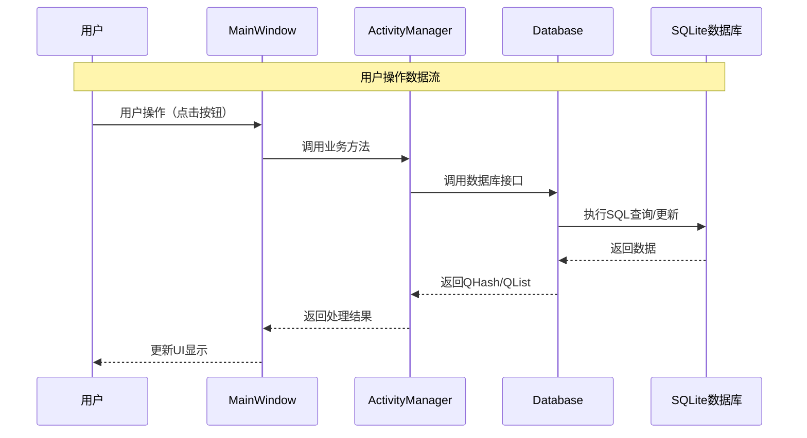
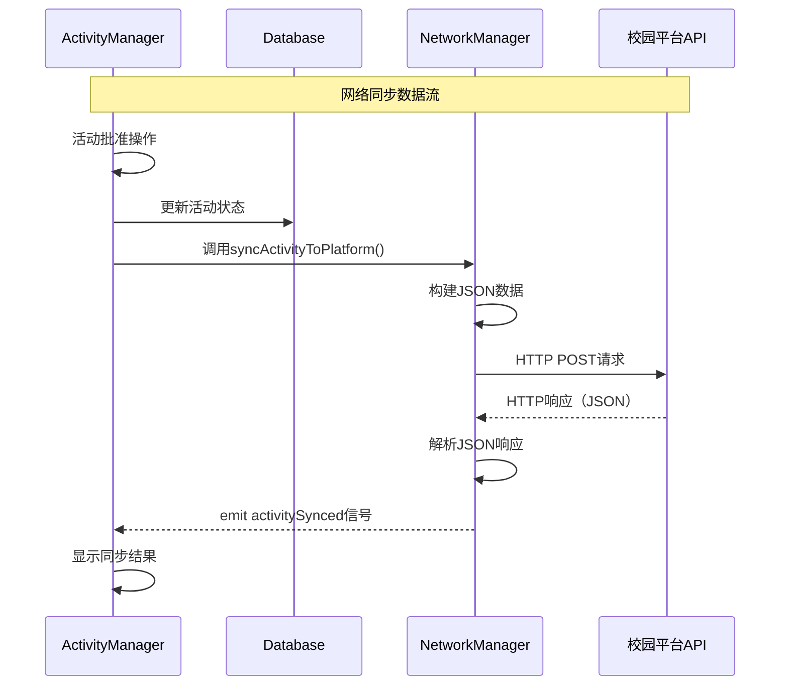
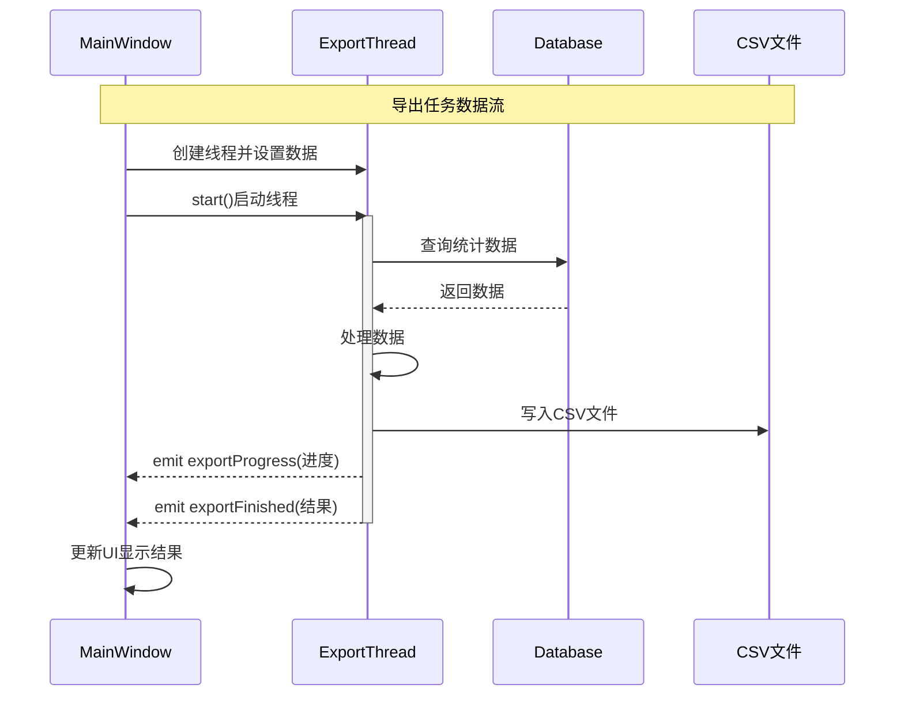
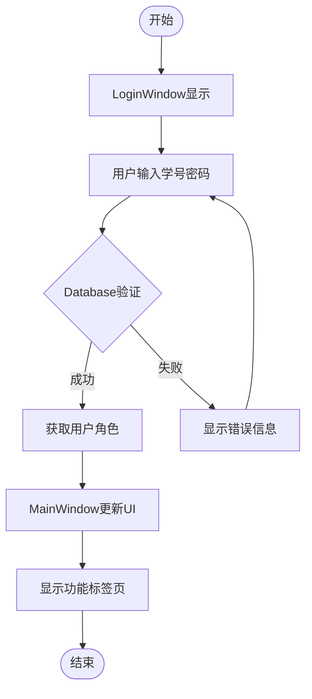
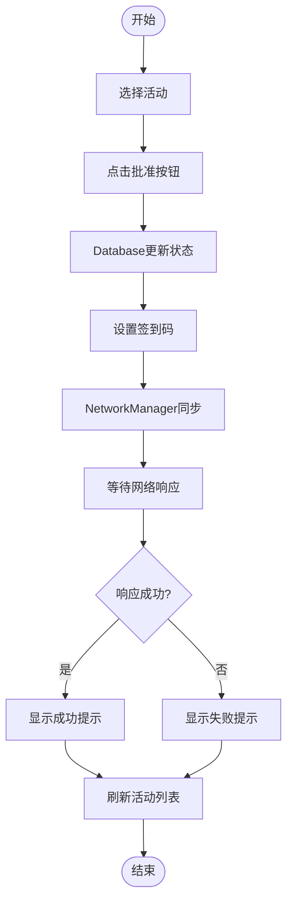
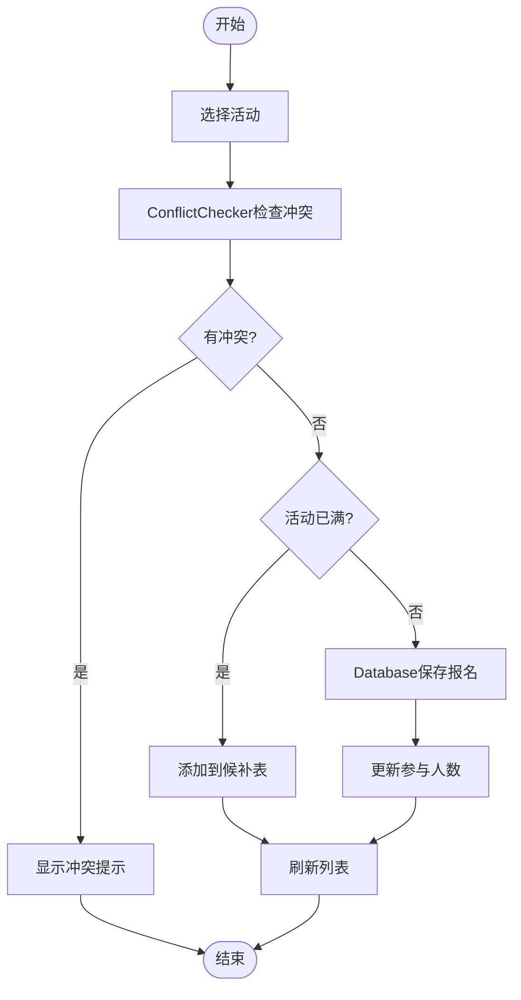
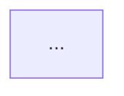

# 系统总体架构图 - Mermaid格式

本文档包含系统架构的所有 Mermaid 图表代码，可直接在支持 Mermaid 的 Markdown 编辑器中查看，或导出为图片。

---

## 图1：系统整体架构模块图



**图1文字说明（不少于100字）**：

本图展示了校园活动报名与签到管理系统的整体架构，采用经典的分层架构设计模式。系统从上到下分为五个层次：UI层包含MainWindow主窗口和LoginWindow登录窗口，负责用户界面的展示和交互；业务逻辑层包含ActivityManager活动管理器和RegistrationManager报名管理器，负责处理具体的业务逻辑；数据访问层包含Database数据库模块，封装了所有SQLite数据库操作，管理users、activities、registrations、waitlist四张数据表；网络通信层包含NetworkManager网络管理器，负责与校园平台API进行HTTP通信；工作线程层包含ConflictChecker冲突检查线程和ExportThread导出线程，用于后台执行耗时操作。图中实线箭头表示直接调用关系，虚线箭头表示信号槽通信机制。这种分层设计实现了关注点分离，提高了系统的可维护性和可扩展性。各层之间通过清晰的接口进行交互，UI层通过信号槽机制与网络层和线程层通信，业务逻辑层通过Database模块统一访问数据，确保了系统的松耦合和高内聚。

---

## 图2：模块关系图



**图2文字说明（不少于100字）**：

本图从四个维度展示了系统各模块之间的关系。控制关系维度显示MainWindow作为主控制器，统一管理ActivityManager、RegistrationManager和LoginWindow三个业务模块，体现了单一职责原则和集中控制的设计思想。数据关系维度展示了业务模块通过Database模块访问SQLite数据库的层次结构，所有数据访问都经过Database模块的统一封装，保证了数据访问的一致性和安全性。通信关系维度使用虚线箭头表示信号槽机制，NetworkManager通过信号槽与ActivityManager和MainWindow通信，ConflictChecker和ExportThread通过信号槽与对应的业务模块通信，这种异步通信方式避免了模块间的直接依赖。网络关系维度展示了NetworkManager通过HTTP协议与外部校园平台API的交互。这种多维度关系设计使得系统模块职责清晰，依赖关系明确，便于系统的维护和扩展。通过信号槽机制实现的松耦合通信，使得模块可以独立开发和测试，提高了系统的灵活性和可测试性。

---

## 图3：用户操作数据流



**图3文字说明（不少于100字）**：

本时序图详细展示了用户操作在系统中的完整数据流转过程。当用户在界面上进行操作（如点击按钮）时，操作首先传递到MainWindow主窗口，MainWindow作为控制器负责将用户操作转发给相应的业务模块。ActivityManager接收到调用后，根据业务逻辑需求调用Database模块提供的接口，Database模块将业务请求转换为SQL语句，在SQLite数据库中执行查询或更新操作。SQLite数据库执行完成后，将结果数据返回给Database模块，Database模块将原始数据封装成QHash或QList等Qt标准数据结构返回给业务层。ActivityManager接收到数据后，根据业务规则进行数据处理和格式化，然后将处理结果返回给MainWindow。最后，MainWindow根据返回的结果更新用户界面，完成整个数据流转过程。这种单向的数据流设计保证了数据的一致性，每一层都只与相邻层交互，降低了系统的复杂度。通过标准化的数据结构（QHash/QList）在不同层之间传递数据，提高了系统的可维护性。

---

## 图4：网络同步数据流



**图4文字说明（不少于100字）**：

本时序图展示了活动批准后同步到校园平台的完整网络通信流程。当管理员在ActivityManager中批准一个活动后，系统首先在本地Database中更新活动状态，确保本地数据的一致性。然后ActivityManager调用NetworkManager的syncActivityToPlatform()方法，将活动数据传递给网络模块。NetworkManager接收到数据后，将活动信息（包括标题、描述、时间、地点等）转换为JSON格式，这是现代Web API常用的数据交换格式。NetworkManager使用HTTP POST方法将JSON数据发送到校园平台API服务器，这是一个异步操作，不会阻塞UI线程。校园平台API处理请求后，返回HTTP响应，响应内容也是JSON格式，包含同步是否成功的信息。NetworkManager接收到响应后，使用QJsonDocument解析JSON数据，提取同步结果。最后，NetworkManager通过emit activitySynced信号将结果通知给ActivityManager，ActivityManager根据同步结果显示成功或失败的提示信息。这种异步网络通信设计确保了UI的响应性，即使网络请求耗时较长，用户界面也不会冻结。通过信号槽机制实现的结果通知，实现了网络层与UI层的解耦。

---

## 图5：后台任务数据流



**图5文字说明（不少于100字）**：

本时序图展示了后台导出任务的完整执行流程，体现了多线程编程在系统中的应用。当用户在MainWindow中请求导出统计报表时，MainWindow首先创建ExportThread导出线程对象，并设置导出类型、文件名和要导出的数据。然后MainWindow调用start()方法启动线程，此时ExportThread在独立的工作线程中运行，不会阻塞主UI线程。线程激活后，ExportThread从Database中查询需要导出的统计数据，Database返回查询结果。ExportThread接收到数据后，在后台线程中进行数据处理和格式化，这个过程可能涉及大量数据的处理。处理完成后，ExportThread将数据写入CSV文件，文件写入操作在后台线程中执行，不会影响UI的响应性。在导出过程中，ExportThread通过emit exportProgress信号定期向MainWindow报告导出进度，MainWindow可以据此更新进度条，给用户提供良好的反馈。导出完成后，ExportThread通过emit exportFinished信号通知MainWindow导出结果，MainWindow根据结果更新UI，显示成功或失败的提示信息。这种设计充分利用了多线程的优势，将耗时操作放在后台执行，保证了用户体验的流畅性。通过信号机制实现线程间通信，确保了线程安全性。

---

## 图6：登录控制流



**图6文字说明（不少于100字）**：

本流程图展示了用户登录系统的完整控制流程，体现了系统的安全认证机制。流程从LoginWindow显示登录界面开始，用户需要输入学号和密码进行身份验证。系统将用户输入的凭据传递给Database模块进行验证，Database模块查询users表，比对密码哈希值，验证用户身份的有效性。如果验证失败，系统显示错误信息，并允许用户重新输入，这体现了友好的错误处理机制。如果验证成功，Database模块返回用户的角色信息（管理员、发起人或学生），系统根据角色信息更新MainWindow的UI界面，显示与用户角色对应的功能标签页。不同角色的用户看到的功能不同：管理员可以看到所有活动和管理功能，发起人只能看到自己创建的活动，学生只能看到已批准的活动。这种基于角色的访问控制（RBAC）确保了系统的安全性。整个登录流程设计简洁明了，错误处理完善，用户体验良好。通过Database模块统一管理用户认证，保证了认证逻辑的一致性和安全性。

---

## 图7：活动审批控制流



**图7文字说明（不少于100字）**：

本流程图展示了管理员审批活动的完整业务流程，体现了系统的工作流管理能力。流程从管理员在活动列表中选择待审批的活动开始，管理员点击批准按钮触发审批流程。系统首先在Database中更新活动的状态为"已批准"，这是数据持久化的关键步骤。然后系统弹出对话框，允许管理员设置或修改活动的签到码，签到码用于学生签到时的身份验证，增强了活动的安全性。签到码设置完成后，系统调用NetworkManager将活动信息同步到校园平台，这是系统与外部系统集成的体现。NetworkManager发送HTTP请求后，系统进入等待状态，等待校园平台API的响应。根据响应结果，系统显示相应的提示信息：如果同步成功，显示成功提示；如果同步失败（如网络错误），显示失败提示，但本地审批状态已经保存，保证了数据的一致性。最后，系统刷新活动列表，更新UI显示最新的活动状态。这个流程设计考虑了网络同步可能失败的情况，采用了容错机制，即使网络同步失败，本地审批操作仍然有效，体现了系统的健壮性。

---

## 图8：报名控制流



**图8文字说明（不少于100字）**：

本流程图展示了学生报名活动的完整业务流程，体现了系统的业务规则处理能力。流程从学生在活动列表中选择要报名的活动开始，系统首先启动ConflictChecker冲突检查线程，在后台检查该学生是否已经报名了与当前活动时间冲突的其他活动。冲突检查是一个复杂的数据库查询操作，在后台线程中执行可以避免阻塞UI。如果检测到时间冲突，系统显示冲突提示，列出冲突的活动信息，并阻止报名操作，这体现了系统的业务规则验证能力。如果没有冲突，系统继续检查活动是否已满员。如果活动已满，系统自动将学生添加到候补表（waitlist）中，实现了候补排队机制，当有学生取消报名时，候补列表中的学生可以自动补位。如果活动未满，系统在Database中保存报名记录，并更新活动的当前参与人数。最后，系统刷新报名列表，更新UI显示最新的报名状态。这个流程设计充分考虑了实际业务场景：时间冲突检测避免了学生同时参加多个活动，候补机制保证了活动的公平性，自动更新参与人数保证了数据的一致性。整个流程逻辑清晰，错误处理完善，用户体验良好。

---

## 图9：信号槽关系图

```mermaid
flowchart TB
    subgraph MainWindow信号槽["MainWindow 信号槽连接"]
        MW[MainWindow]
        MW_S1[onCategoriesReceived<br/>接收活动类别]
        MW_S2[onAnnouncementsReceived<br/>接收公告]
        MW_S3[onNetworkError<br/>网络错误处理]
        MW_S4[onExportProgress<br/>导出进度]
        MW_S5[onExportFinished<br/>导出完成]
    end
    
    subgraph ActivityManager信号槽["ActivityManager 信号槽连接"]
        AM[ActivityManager]
        AM_S1[显示同步结果<br/>显示同步成功/失败]
        AM_B1[onCreateActivity<br/>创建活动]
        AM_B2[onApproveActivity<br/>批准活动]
    end
    
    subgraph RegistrationManager信号槽["RegistrationManager 信号槽连接"]
        RM[RegistrationManager]
        RM_S1[onConflictDetected<br/>处理冲突]
        RM_S2[onCheckCompleted<br/>检查完成]
    end
    
    subgraph NetworkManager信号["NetworkManager 信号"]
        NM[NetworkManager]
        NM_E1[emit categoriesReceived<br/>发出活动类别]
        NM_E2[emit announcementsReceived<br/>发出公告]
        NM_E3[emit activitySynced<br/>发出同步结果]
        NM_E4[emit errorOccurred<br/>发出错误]
    end
    
    subgraph ExportThread信号["ExportThread 信号"]
        ET[ExportThread]
        ET_E1[emit exportProgress<br/>发出进度]
        ET_E2[emit exportFinished<br/>发出完成]
    end
    
    subgraph ConflictChecker信号["ConflictChecker 信号"]
        CC[ConflictChecker]
        CC_E1[emit conflictDetected<br/>发出冲突]
        CC_E2[emit checkCompleted<br/>发出完成]
    end
    
    %% NetworkManager 到 MainWindow
    NM_E1 -.->|connect| MW_S1
    NM_E2 -.->|connect| MW_S2
    NM_E4 -.->|connect| MW_S3
    
    %% NetworkManager 到 ActivityManager
    NM_E3 -.->|connect| AM_S1
    
    %% ExportThread 到 MainWindow
    ET_E1 -.->|connect| MW_S4
    ET_E2 -.->|connect| MW_S5
    
    %% ConflictChecker 到 RegistrationManager
    CC_E1 -.->|connect| RM_S1
    CC_E2 -.->|connect| RM_S2
    
    %% 按钮事件（内部连接）
    AM -->|按钮点击| AM_B1
    AM -->|按钮点击| AM_B2
    
    style MW fill:#e1f5ff
    style AM fill:#fff4e1
    style RM fill:#fff4e1
    style NM fill:#f3e5f5
    style ET fill:#fff9c4
    style CC fill:#fff9c4
```



**图9文字说明（不少于100字）**：

本图全面展示了系统中所有模块之间的信号槽连接关系，这是Qt框架实现模块间通信的核心机制。图中将信号槽关系按照模块分组展示，清晰地显示了每个模块发出的信号和接收的槽函数。MainWindow作为主窗口，连接了NetworkManager的多个信号，用于接收网络操作的结果，包括活动类别、公告信息和错误信息，同时还连接了ExportThread的信号，用于显示导出进度和完成状态。ActivityManager连接了NetworkManager的activitySynced信号，用于在活动同步完成后显示结果提示。RegistrationManager连接了ConflictChecker的两个信号，用于处理冲突检测的结果。NetworkManager、ExportThread和ConflictChecker作为信号发送方，通过emit关键字发出信号，这些信号会被连接到相应的槽函数。信号槽机制的优势在于实现了发送者和接收者的解耦，发送者不需要知道接收者的具体实现，只需要发出信号即可。这种设计模式使得系统具有良好的可扩展性，可以轻松添加新的信号接收者，而不需要修改信号发送者的代码。所有信号槽连接都使用虚线箭头表示，体现了这种异步、松耦合的通信方式。通过信号槽机制，系统实现了模块间的异步通信，保证了UI的响应性和系统的灵活性。

---

## 使用说明

### 在 Markdown 中查看

1. **VS Code**: 安装 "Markdown Preview Mermaid Support" 扩展
2. **GitHub/GitLab**: 直接支持 Mermaid 语法
3. **Typora**: 原生支持 Mermaid
4. **在线工具**: 访问 https://mermaid.live/ 粘贴代码查看

### 导出为图片

1. **使用 Mermaid CLI**:
   ```bash
   npm install -g @mermaid-js/mermaid-cli
   mmdc -i 系统架构图_Mermaid.md -o 系统架构图.png
   ```

2. **使用在线工具**: 
   - 访问 https://mermaid.live/
   - 粘贴代码
   - 点击 "Actions" → "Download PNG/SVG"

3. **使用 VS Code 扩展**:
   - 安装 "Markdown Preview Mermaid Support"
   - 右键预览 → 导出为图片

### 在文档中引用

在 Markdown 文档中直接使用：

````markdown

````

---

## 文字说明（不少于100字）

本系统采用分层架构设计，将UI层、业务逻辑层、数据访问层和网络通信层清晰分离。MainWindow作为主控制器，统一管理各个功能模块。ActivityManager和RegistrationManager负责具体的业务逻辑处理，通过Database模块访问SQLite数据库。NetworkManager独立处理HTTP网络请求，采用异步方式避免阻塞UI线程。系统使用QThread实现多线程处理，ConflictChecker用于后台检查时间冲突，ExportThread用于后台导出CSV文件。所有模块之间通过Qt的信号槽机制进行通信，实现了松耦合的设计。数据流向清晰：用户操作通过UI层传递到业务层，业务层调用数据层进行持久化，网络层独立处理外部API交互，工作线程处理耗时操作。这种架构设计保证了系统的可维护性和可扩展性。

