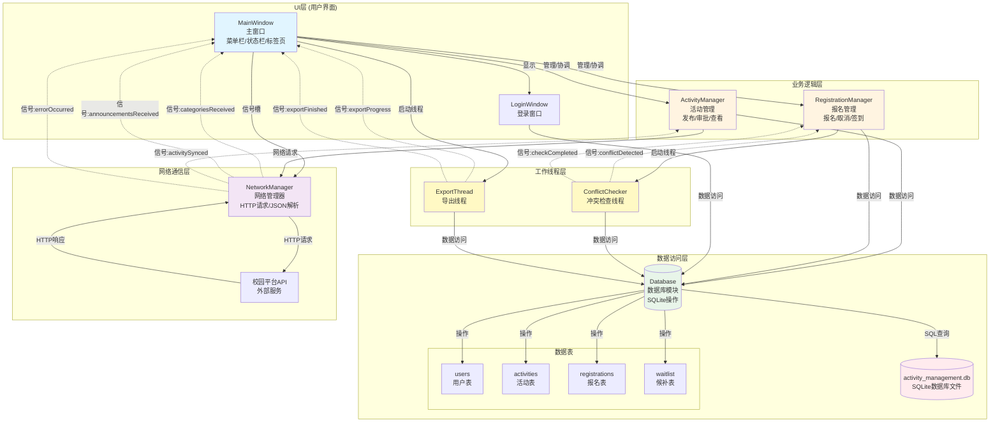
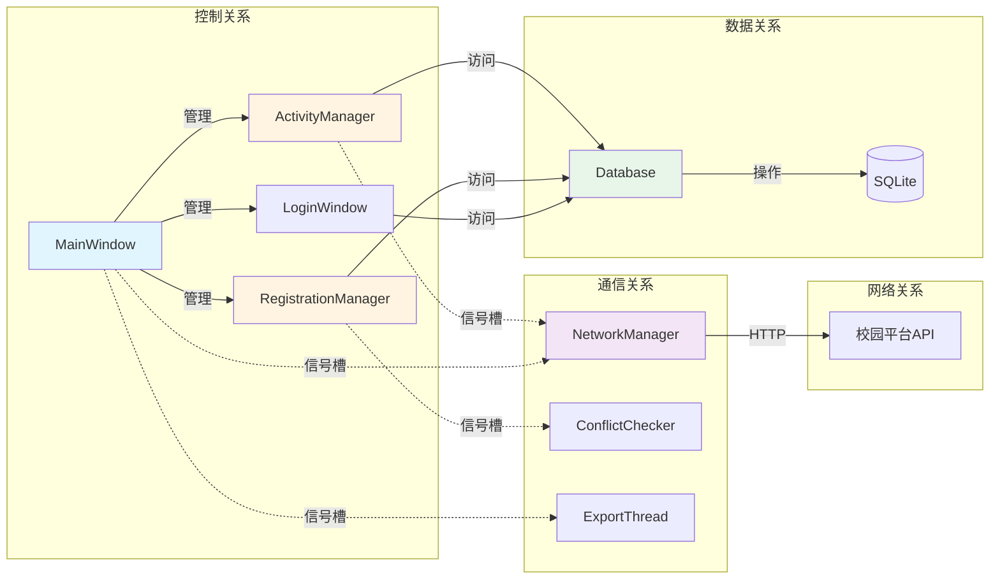
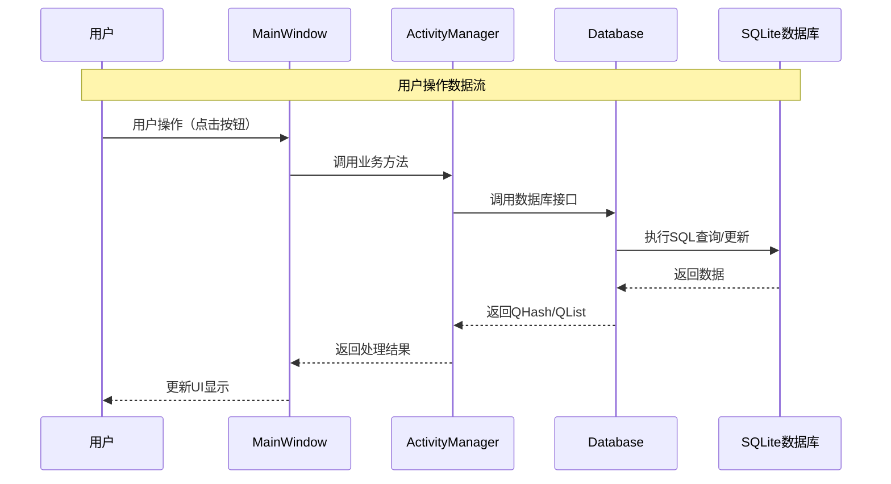
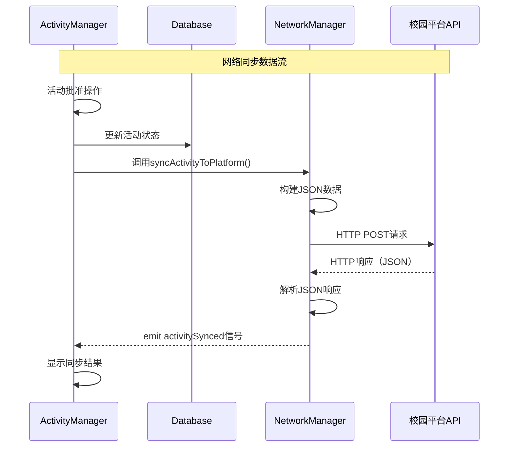
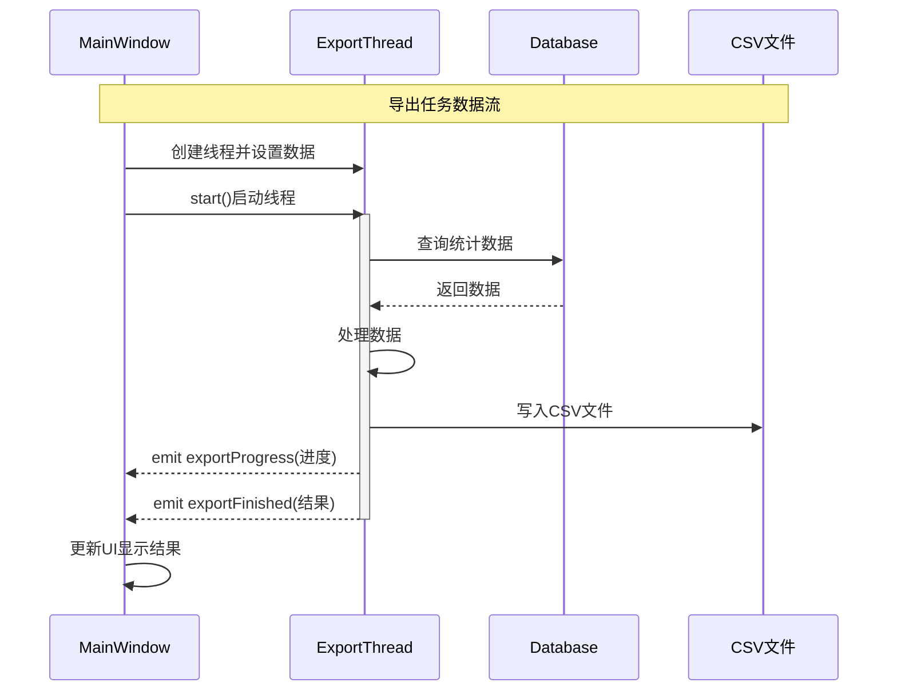
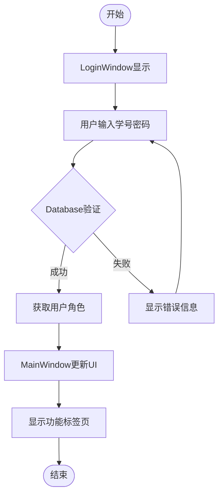
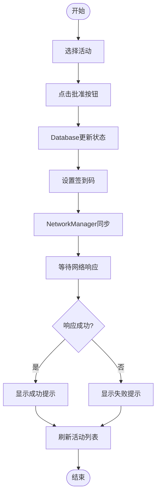
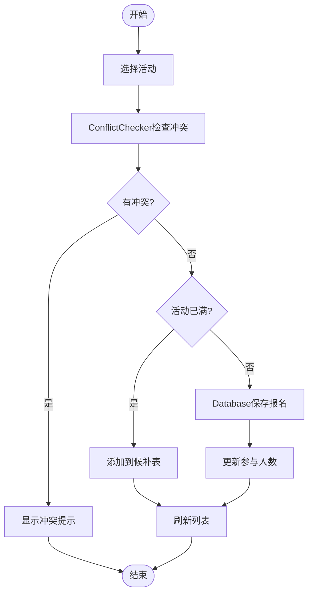
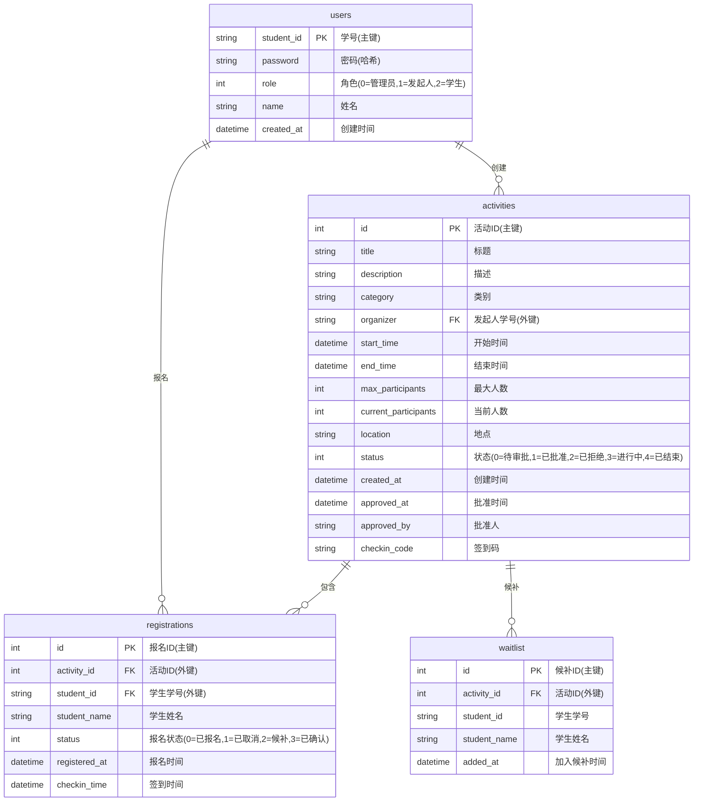

# 校园活动报名与签到管理系统 - 系统设计文档

## 2.1 系统总体架构图

### 系统整体模块图

#### 图1：系统整体架构模块图



**图1文字说明（不少于100字）**：

本图展示了校园活动报名与签到管理系统的整体架构，采用经典的分层架构设计模式。系统从上到下分为五个层次：UI层包含MainWindow主窗口和LoginWindow登录窗口，负责用户界面的展示和交互；业务逻辑层包含ActivityManager活动管理器和RegistrationManager报名管理器，负责处理具体的业务逻辑；数据访问层包含Database数据库模块，封装了所有SQLite数据库操作，管理users、activities、registrations、waitlist四张数据表；网络通信层包含NetworkManager网络管理器，负责与校园平台API进行HTTP通信；工作线程层包含ConflictChecker冲突检查线程和ExportThread导出线程，用于后台执行耗时操作。图中实线箭头表示直接调用关系，虚线箭头表示信号槽通信机制。这种分层设计实现了关注点分离，提高了系统的可维护性和可扩展性。各层之间通过清晰的接口进行交互，UI层通过信号槽机制与网络层和线程层通信，业务逻辑层通过Database模块统一访问数据，确保了系统的松耦合和高内聚。

### 模块之间的关系

#### 图2：模块关系图



**图2文字说明（不少于100字）**：

本图从四个维度展示了系统各模块之间的关系。控制关系维度显示MainWindow作为主控制器，统一管理ActivityManager、RegistrationManager和LoginWindow三个业务模块，体现了单一职责原则和集中控制的设计思想。数据关系维度展示了业务模块通过Database模块访问SQLite数据库的层次结构，所有数据访问都经过Database模块的统一封装，保证了数据访问的一致性和安全性。通信关系维度使用虚线箭头表示信号槽机制，NetworkManager通过信号槽与ActivityManager和MainWindow通信，ConflictChecker和ExportThread通过信号槽与对应的业务模块通信，这种异步通信方式避免了模块间的直接依赖。网络关系维度展示了NetworkManager通过HTTP协议与外部校园平台API的交互。这种多维度关系设计使得系统模块职责清晰，依赖关系明确，便于系统的维护和扩展。通过信号槽机制实现的松耦合通信，使得模块可以独立开发和测试，提高了系统的灵活性和可测试性。

**关系说明**：
1. **MainWindow** 作为主控制器，管理所有UI组件和业务模块
2. **ActivityManager** 和 **RegistrationManager** 负责各自的业务逻辑，通过 **Database** 访问数据
3. **NetworkManager** 独立处理网络请求，通过信号槽与UI通信
4. **WorkerThread**（ConflictChecker、ExportThread）在后台执行耗时操作，避免阻塞UI

### 数据流说明

#### 图3：数据流图



**图3文字说明（不少于100字）**：

本时序图详细展示了用户操作在系统中的完整数据流转过程。当用户在界面上进行操作（如点击按钮）时，操作首先传递到MainWindow主窗口，MainWindow作为控制器负责将用户操作转发给相应的业务模块。ActivityManager接收到调用后，根据业务逻辑需求调用Database模块提供的接口，Database模块将业务请求转换为SQL语句，在SQLite数据库中执行查询或更新操作。SQLite数据库执行完成后，将结果数据返回给Database模块，Database模块将原始数据封装成QHash或QList等Qt标准数据结构返回给业务层。ActivityManager接收到数据后，根据业务规则进行数据处理和格式化，然后将处理结果返回给MainWindow。最后，MainWindow根据返回的结果更新用户界面，完成整个数据流转过程。这种单向的数据流设计保证了数据的一致性，每一层都只与相邻层交互，降低了系统的复杂度。通过标准化的数据结构（QHash/QList）在不同层之间传递数据，提高了系统的可维护性。

#### 图4：网络同步数据流



**图4文字说明（不少于100字）**：

本时序图展示了活动批准后同步到校园平台的完整网络通信流程。当管理员在ActivityManager中批准一个活动后，系统首先在本地Database中更新活动状态，确保本地数据的一致性。然后ActivityManager调用NetworkManager的syncActivityToPlatform()方法，将活动数据传递给网络模块。NetworkManager接收到数据后，将活动信息（包括标题、描述、时间、地点等）转换为JSON格式，这是现代Web API常用的数据交换格式。NetworkManager使用HTTP POST方法将JSON数据发送到校园平台API服务器，这是一个异步操作，不会阻塞UI线程。校园平台API处理请求后，返回HTTP响应，响应内容也是JSON格式，包含同步是否成功的信息。NetworkManager接收到响应后，使用QJsonDocument解析JSON数据，提取同步结果。最后，NetworkManager通过emit activitySynced信号将结果通知给ActivityManager，ActivityManager根据同步结果显示成功或失败的提示信息。这种异步网络通信设计确保了UI的响应性，即使网络请求耗时较长，用户界面也不会冻结。通过信号槽机制实现的结果通知，实现了网络层与UI层的解耦。

#### 图5：后台任务数据流



**图5文字说明（不少于100字）**：

本时序图展示了后台导出任务的完整执行流程，体现了多线程编程在系统中的应用。当用户在MainWindow中请求导出统计报表时，MainWindow首先创建ExportThread导出线程对象，并设置导出类型、文件名和要导出的数据。然后MainWindow调用start()方法启动线程，此时ExportThread在独立的工作线程中运行，不会阻塞主UI线程。线程激活后，ExportThread从Database中查询需要导出的统计数据，Database返回查询结果。ExportThread接收到数据后，在后台线程中进行数据处理和格式化，这个过程可能涉及大量数据的处理。处理完成后，ExportThread将数据写入CSV文件，文件写入操作在后台线程中执行，不会影响UI的响应性。在导出过程中，ExportThread通过emit exportProgress信号定期向MainWindow报告导出进度，MainWindow可以据此更新进度条，给用户提供良好的反馈。导出完成后，ExportThread通过emit exportFinished信号通知MainWindow导出结果，MainWindow根据结果更新UI，显示成功或失败的提示信息。这种设计充分利用了多线程的优势，将耗时操作放在后台执行，保证了用户体验的流畅性。通过信号机制实现线程间通信，确保了线程安全性。

**数据流说明**：

1. **用户操作流程**：
   - 用户操作 → MainWindow → ActivityManager/RegistrationManager → Database → SQLite
   - 数据返回：SQLite → Database → Manager → MainWindow → UI更新

2. **网络同步流程**：
   - 活动批准 → ActivityManager → NetworkManager → HTTP请求 → 校园平台API
   - 响应返回：API → NetworkManager → 信号 → ActivityManager → UI提示

3. **后台任务流程**：
   - 导出请求 → MainWindow → ExportThread（后台） → CSV文件
   - 冲突检查 → RegistrationManager → ConflictChecker（后台） → 结果信号 → UI显示

### 控制流说明

#### 图6：登录控制流



**图6文字说明（不少于100字）**：

本流程图展示了用户登录系统的完整控制流程，体现了系统的安全认证机制。流程从LoginWindow显示登录界面开始，用户需要输入学号和密码进行身份验证。系统将用户输入的凭据传递给Database模块进行验证，Database模块查询users表，比对密码哈希值，验证用户身份的有效性。如果验证失败，系统显示错误信息，并允许用户重新输入，这体现了友好的错误处理机制。如果验证成功，Database模块返回用户的角色信息（管理员、发起人或学生），系统根据角色信息更新MainWindow的UI界面，显示与用户角色对应的功能标签页。不同角色的用户看到的功能不同：管理员可以看到所有活动和管理功能，发起人只能看到自己创建的活动，学生只能看到已批准的活动。这种基于角色的访问控制（RBAC）确保了系统的安全性。整个登录流程设计简洁明了，错误处理完善，用户体验良好。通过Database模块统一管理用户认证，保证了认证逻辑的一致性和安全性。

#### 图7：活动审批控制流



**图7文字说明（不少于100字）**：

本流程图展示了管理员审批活动的完整业务流程，体现了系统的工作流管理能力。流程从管理员在活动列表中选择待审批的活动开始，管理员点击批准按钮触发审批流程。系统首先在Database中更新活动的状态为"已批准"，这是数据持久化的关键步骤。然后系统弹出对话框，允许管理员设置或修改活动的签到码，签到码用于学生签到时的身份验证，增强了活动的安全性。签到码设置完成后，系统调用NetworkManager将活动信息同步到校园平台，这是系统与外部系统集成的体现。NetworkManager发送HTTP请求后，系统进入等待状态，等待校园平台API的响应。根据响应结果，系统显示相应的提示信息：如果同步成功，显示成功提示；如果同步失败（如网络错误），显示失败提示，但本地审批状态已经保存，保证了数据的一致性。最后，系统刷新活动列表，更新UI显示最新的活动状态。这个流程设计考虑了网络同步可能失败的情况，采用了容错机制，即使网络同步失败，本地审批操作仍然有效，体现了系统的健壮性。

#### 图8：报名控制流



**图8文字说明（不少于100字）**：

本流程图展示了学生报名活动的完整业务流程，体现了系统的业务规则处理能力。流程从学生在活动列表中选择要报名的活动开始，系统首先启动ConflictChecker冲突检查线程，在后台检查该学生是否已经报名了与当前活动时间冲突的其他活动。冲突检查是一个复杂的数据库查询操作，在后台线程中执行可以避免阻塞UI。如果检测到时间冲突，系统显示冲突提示，列出冲突的活动信息，并阻止报名操作，这体现了系统的业务规则验证能力。如果没有冲突，系统继续检查活动是否已满员。如果活动已满，系统自动将学生添加到候补表（waitlist）中，实现了候补排队机制，当有学生取消报名时，候补列表中的学生可以自动补位。如果活动未满，系统在Database中保存报名记录，并更新活动的当前参与人数。最后，系统刷新报名列表，更新UI显示最新的报名状态。这个流程设计充分考虑了实际业务场景：时间冲突检测避免了学生同时参加多个活动，候补机制保证了活动的公平性，自动更新参与人数保证了数据的一致性。整个流程逻辑清晰，错误处理完善，用户体验良好。

**控制流说明**：

1. **登录流程**：LoginWindow → Database验证 → MainWindow更新UI
2. **活动审批流程**：ActivityManager → Database更新状态 → NetworkManager同步 → 信号通知
3. **报名流程**：RegistrationManager → ConflictChecker检查 → Database保存 → UI刷新

### 模块之间的信号槽关系

#### 图9：信号槽关系图

```mermaid
flowchart TB
    subgraph MainWindow信号槽["MainWindow 信号槽连接"]
        MW[MainWindow]
        MW_S1[onCategoriesReceived<br/>接收活动类别]
        MW_S2[onAnnouncementsReceived<br/>接收公告]
        MW_S3[onNetworkError<br/>网络错误处理]
        MW_S4[onExportProgress<br/>导出进度]
        MW_S5[onExportFinished<br/>导出完成]
    end
    
    subgraph ActivityManager信号槽["ActivityManager 信号槽连接"]
        AM[ActivityManager]
        AM_S1[显示同步结果<br/>显示同步成功/失败]
        AM_B1[onCreateActivity<br/>创建活动]
        AM_B2[onApproveActivity<br/>批准活动]
    end
    
    subgraph RegistrationManager信号槽["RegistrationManager 信号槽连接"]
        RM[RegistrationManager]
        RM_S1[onConflictDetected<br/>处理冲突]
        RM_S2[onCheckCompleted<br/>检查完成]
    end
    
    subgraph NetworkManager信号["NetworkManager 信号"]
        NM[NetworkManager]
        NM_E1[emit categoriesReceived<br/>发出活动类别]
        NM_E2[emit announcementsReceived<br/>发出公告]
        NM_E3[emit activitySynced<br/>发出同步结果]
        NM_E4[emit errorOccurred<br/>发出错误]
    end
    
    subgraph ExportThread信号["ExportThread 信号"]
        ET[ExportThread]
        ET_E1[emit exportProgress<br/>发出进度]
        ET_E2[emit exportFinished<br/>发出完成]
    end
    
    subgraph ConflictChecker信号["ConflictChecker 信号"]
        CC[ConflictChecker]
        CC_E1[emit conflictDetected<br/>发出冲突]
        CC_E2[emit checkCompleted<br/>发出完成]
    end
    
    %% NetworkManager 到 MainWindow
    NM_E1 -.->|connect| MW_S1
    NM_E2 -.->|connect| MW_S2
    NM_E4 -.->|connect| MW_S3
    
    %% NetworkManager 到 ActivityManager
    NM_E3 -.->|connect| AM_S1
    
    %% ExportThread 到 MainWindow
    ET_E1 -.->|connect| MW_S4
    ET_E2 -.->|connect| MW_S5
    
    %% ConflictChecker 到 RegistrationManager
    CC_E1 -.->|connect| RM_S1
    CC_E2 -.->|connect| RM_S2
    
    %% 按钮事件（内部连接）
    AM -->|按钮点击| AM_B1
    AM -->|按钮点击| AM_B2
    
    style MW fill:#e1f5ff
    style AM fill:#fff4e1
    style RM fill:#fff4e1
    style NM fill:#f3e5f5
    style ET fill:#fff9c4
    style CC fill:#fff9c4
```



**图9文字说明（不少于100字）**：

本图全面展示了系统中所有模块之间的信号槽连接关系，这是Qt框架实现模块间通信的核心机制。图中将信号槽关系按照模块分组展示，清晰地显示了每个模块发出的信号和接收的槽函数。MainWindow作为主窗口，连接了NetworkManager的多个信号，用于接收网络操作的结果，包括活动类别、公告信息和错误信息，同时还连接了ExportThread的信号，用于显示导出进度和完成状态。ActivityManager连接了NetworkManager的activitySynced信号，用于在活动同步完成后显示结果提示。RegistrationManager连接了ConflictChecker的两个信号，用于处理冲突检测的结果。NetworkManager、ExportThread和ConflictChecker作为信号发送方，通过emit关键字发出信号，这些信号会被连接到相应的槽函数。信号槽机制的优势在于实现了发送者和接收者的解耦，发送者不需要知道接收者的具体实现，只需要发出信号即可。这种设计模式使得系统具有良好的可扩展性，可以轻松添加新的信号接收者，而不需要修改信号发送者的代码。所有信号槽连接都使用虚线箭头表示，体现了这种异步、松耦合的通信方式。通过信号槽机制，系统实现了模块间的异步通信，保证了UI的响应性和系统的灵活性。

**信号槽关系说明**：

**MainWindow**：
  - `connect(NetworkManager::categoriesReceived)` → `onCategoriesReceived()` - 接收活动类别列表
  - `connect(NetworkManager::announcementsReceived)` → `onAnnouncementsReceived()` - 接收公告列表
  - `connect(NetworkManager::errorOccurred)` → `onNetworkError()` - 处理网络错误
  - `connect(ExportThread::exportProgress)` → 更新导出进度
  - `connect(ExportThread::exportFinished)` → 显示导出完成提示

**ActivityManager**：
  - `connect(NetworkManager::activitySynced)` → 显示同步结果对话框
  - 按钮点击事件 → `onCreateActivity()` / `onApproveActivity()` - 内部槽函数

**RegistrationManager**：
  - `connect(ConflictChecker::conflictDetected)` → `onConflictDetected()` - 显示冲突提示
  - `connect(ConflictChecker::checkCompleted)` → `onCheckCompleted()` - 处理检查完成

**NetworkManager**：
  - `emit categoriesReceived()` → MainWindow接收
  - `emit announcementsReceived()` → MainWindow接收
  - `emit activitySynced()` → ActivityManager接收
  - `emit errorOccurred()` → MainWindow接收

**ExportThread**：
  - `emit exportProgress(int)` → MainWindow更新进度条
  - `emit exportFinished(bool, QString)` → MainWindow显示结果

**ConflictChecker**：
  - `emit conflictDetected(QList)` → RegistrationManager显示冲突
  - `emit checkCompleted(bool)` → RegistrationManager处理结果

**文字说明（不少于100字）**：

本系统采用分层架构设计，将UI层、业务逻辑层、数据访问层和网络通信层清晰分离。MainWindow作为主控制器，统一管理各个功能模块。ActivityManager和RegistrationManager负责具体的业务逻辑处理，通过Database模块访问SQLite数据库。NetworkManager独立处理HTTP网络请求，采用异步方式避免阻塞UI线程。系统使用QThread实现多线程处理，ConflictChecker用于后台检查时间冲突，ExportThread用于后台导出CSV文件。所有模块之间通过Qt的信号槽机制进行通信，实现了松耦合的设计。数据流向清晰：用户操作通过UI层传递到业务层，业务层调用数据层进行持久化，网络层独立处理外部API交互，工作线程处理耗时操作。这种架构设计保证了系统的可维护性和可扩展性。

---

## 2.2 模块设计说明

| 模块名称 | 职责 | 输入输出 | 所用技术 |
|---------|------|---------|---------|
| **MainWindow** | 管理主窗口UI布局、菜单栏、状态栏；协调各功能模块；处理用户登录状态；管理标签页切换 | 输入：用户操作事件、网络响应信号<br>输出：UI更新、菜单操作、窗口状态 | Qt Widgets (QMainWindow, QTabWidget, QMenuBar, QStatusBar) |
| **ActivityManager** | 活动管理业务逻辑：发布活动、审批活动、查看详情、搜索过滤、手动同步；根据用户角色显示不同功能 | 输入：用户操作、数据库查询结果<br>输出：活动列表显示、对话框提示 | Qt Widgets (QTableWidget, QDialog, QPushButton, QLineEdit) |
| **RegistrationManager** | 报名管理业务逻辑：活动报名、取消报名、查看候补、签到管理、冲突检测；学生和管理员不同视图 | 输入：用户操作、活动数据<br>输出：报名列表、冲突提示、签到统计 | Qt Widgets (QTableWidget, QTabWidget, QComboBox) |
| **Database** | 数据持久化层：封装所有SQLite数据库操作；提供用户认证、活动CRUD、报名管理、签到记录、统计查询等接口 | 输入：业务数据（活动、报名、用户信息）<br>输出：查询结果（QHash/QList） | Qt SQL (QSqlDatabase, QSqlQuery, QSqlError) |
| **NetworkManager** | 网络通信模块：HTTP请求处理、JSON数据解析、与校园平台API交互；异步网络操作，不阻塞UI | 输入：API请求参数<br>输出：信号通知（categoriesReceived, announcementsReceived, activitySynced） | QNetworkAccessManager, QNetworkReply, QJsonDocument |
| **ConflictChecker** | 后台线程：检查学生报名活动的时间冲突；避免阻塞UI线程 | 输入：学生ID、活动时间<br>输出：信号（conflictDetected, checkCompleted） | QThread, Database |
| **ExportThread** | 后台线程：执行CSV文件导出操作；支持进度报告 | 输入：导出数据、文件名<br>输出：信号（exportProgress, exportFinished） | QThread, CsvExporter |
| **LoginWindow** | 用户登录界面：处理用户认证、角色识别、新用户注册 | 输入：学号、密码<br>输出：登录状态、用户角色 | Qt Widgets (QDialog, QLineEdit, QPushButton) |

### 模块详细说明

**MainWindow模块**：
- 负责整个应用程序的主窗口管理，包括菜单栏、状态栏、标签页等UI组件的初始化。
- 协调ActivityManager和RegistrationManager两个核心业务模块，根据用户角色动态显示功能。
- 处理网络模块的信号响应，更新UI状态和显示网络操作结果。

**Database模块**：
- 封装了所有数据库操作，提供统一的接口供业务层调用。
- 实现了用户管理、活动管理、报名管理、签到管理等核心功能的数据持久化。
- 使用SQLite作为数据库引擎，支持事务处理和错误处理机制。

**NetworkManager模块**：
- 使用QNetworkAccessManager实现异步HTTP请求，避免阻塞主线程。
- 处理JSON数据的序列化和反序列化，与校园平台API进行数据交互。
- 通过信号槽机制将网络响应结果传递给UI层，实现松耦合设计。

**WorkerThread模块（ConflictChecker、ExportThread）**：
- ConflictChecker在后台线程中执行时间冲突检查，避免复杂查询阻塞UI。
- ExportThread在后台执行CSV文件写入操作，支持大数据量导出。
- 两个线程都通过信号与主线程通信，确保线程安全。

---

## 2.3 数据库结构设计（SQLite）

### 2.3.1 数据库 E-R 图

#### Mermaid格式E-R图（在线查看）



#### ASCII格式E-R图（备用）

```
┌─────────────┐
│    users    │
│─────────────│
│ student_id  │◄────┐ (PK)
│ password    │     │
│ role        │     │
│ name        │     │
│ created_at   │     │
└─────────────┘     │
                     │
                     │ 1:N
                     │
┌─────────────┐      │      ┌─────────────┐
│ activities  │      │      │registrations│
│─────────────│      │      │─────────────│
│ id (PK)     │──────┼──────│ id (PK)     │
│ title       │  1:N │      │ activity_id │◄──FK
│ description │      │      │ student_id  │◄──FK
│ category    │      │      │ student_name│
│ organizer   │◄─────┘      │ status      │
│ start_time  │             │ registered_ │
│ end_time    │             │   at        │
│ max_partici.│             │ checkin_time│
│ current_par.│             └─────────────┘
│ location    │
│ status      │
│ created_at  │
│ approved_at │
│ approved_by │
│ checkin_code│
└─────────────┘
      │
      │ 1:N
      │
┌─────────────┐
│  waitlist   │
│─────────────│
│ id (PK)     │
│ activity_id │◄──FK
│ student_id  │
│ student_name│
│ added_at    │
└─────────────┘
```

**实体关系说明**：
- **users** 与 **activities**：一对多关系（一个发起人可以创建多个活动）
- **activities** 与 **registrations**：一对多关系（一个活动可以有多个报名）
- **users** 与 **registrations**：一对多关系（一个学生可以报名多个活动）
- **activities** 与 **waitlist**：一对多关系（一个活动可以有多个候补学生）

### 2.3.2 表结构定义

#### 表1：users（用户表）

| 字段 | 数据类型 | 说明 | 约束 |
|------|---------|------|------|
| student_id | TEXT | 学号（主键） | PRIMARY KEY, NOT NULL |
| password | TEXT | 密码（SHA256哈希） | NOT NULL |
| role | INTEGER | 用户角色（0=管理员，1=发起人，2=学生） | NOT NULL |
| name | TEXT | 用户姓名 | |
| created_at | DATETIME | 创建时间 | DEFAULT CURRENT_TIMESTAMP |

**索引**：student_id（主键自动索引）

#### 表2：activities（活动表）

| 字段 | 数据类型 | 说明 | 约束 |
|------|---------|------|------|
| id | INTEGER | 活动ID（主键） | PRIMARY KEY, AUTOINCREMENT |
| title | TEXT | 活动标题 | NOT NULL |
| description | TEXT | 活动描述 | |
| category | TEXT | 活动类别 | |
| organizer | TEXT | 发起人学号 | NOT NULL |
| start_time | DATETIME | 开始时间 | NOT NULL |
| end_time | DATETIME | 结束时间 | NOT NULL |
| max_participants | INTEGER | 最大参与人数 | NOT NULL |
| current_participants | INTEGER | 当前参与人数 | DEFAULT 0 |
| location | TEXT | 活动地点 | |
| status | INTEGER | 活动状态（0=待审批，1=已批准，2=已拒绝，3=进行中，4=已结束） | DEFAULT 0 |
| created_at | DATETIME | 创建时间 | DEFAULT CURRENT_TIMESTAMP |
| approved_at | DATETIME | 批准时间 | |
| approved_by | TEXT | 批准人 | |
| checkin_code | TEXT | 签到码 | |

**索引**：
- id（主键自动索引）
- status（idx_activities_status）
- organizer（用于查询发起人的活动）

#### 表3：registrations（报名表）

| 字段 | 数据类型 | 说明 | 约束 |
|------|---------|------|------|
| id | INTEGER | 报名ID（主键） | PRIMARY KEY, AUTOINCREMENT |
| activity_id | INTEGER | 活动ID | NOT NULL, FOREIGN KEY |
| student_id | TEXT | 学生学号 | NOT NULL, FOREIGN KEY |
| student_name | TEXT | 学生姓名 | NOT NULL |
| status | INTEGER | 报名状态（0=已报名，1=已取消，2=候补，3=已确认） | DEFAULT 0 |
| registered_at | DATETIME | 报名时间 | DEFAULT CURRENT_TIMESTAMP |
| checkin_time | DATETIME | 签到时间 | |

**索引**：
- id（主键自动索引）
- activity_id（idx_registrations_activity）
- student_id（idx_registrations_student）
- UNIQUE(activity_id, student_id)（确保每个学生只能报名一次）

**外键约束**：
- activity_id REFERENCES activities(id) ON DELETE CASCADE

#### 表4：waitlist（候补表）

| 字段 | 数据类型 | 说明 | 约束 |
|------|---------|------|------|
| id | INTEGER | 候补ID（主键） | PRIMARY KEY, AUTOINCREMENT |
| activity_id | INTEGER | 活动ID | NOT NULL, FOREIGN KEY |
| student_id | TEXT | 学生学号 | NOT NULL |
| student_name | TEXT | 学生姓名 | NOT NULL |
| added_at | DATETIME | 加入候补时间 | DEFAULT CURRENT_TIMESTAMP |

**索引**：
- id（主键自动索引）
- activity_id（idx_waitlist_activity）

**外键约束**：
- activity_id REFERENCES activities(id) ON DELETE CASCADE
- UNIQUE(activity_id, student_id)（确保每个学生在候补列表中只出现一次）

---

## 2.4 Model/View 设计说明

### 使用的Model类型

本系统主要使用 **QTableWidget** 作为数据展示控件，而不是标准的Model/View架构（QSqlTableModel + QTableView）。原因如下：

1. **业务逻辑复杂**：需要根据用户角色动态过滤数据（如发起人只能看到自己创建的活动，学生只能看到已批准的活动）
2. **多表关联查询**：报名列表需要关联activities表获取活动信息，QSqlTableModel难以直接支持
3. **自定义显示格式**：需要将枚举值（如状态）转换为中文显示，需要自定义格式化逻辑
4. **灵活的数据操作**：需要在表格中显示计算字段（如签到率），需要从多个数据源组合数据

### 为什么不直接往控件塞数据？

虽然当前实现使用了QTableWidget直接填充数据，但系统设计考虑了数据与视图的分离：

1. **数据层封装**：Database模块提供了统一的数据访问接口，返回标准化的数据结构（QHash/QList）
2. **业务逻辑分离**：ActivityManager和RegistrationManager负责数据转换和格式化，UI层只负责显示
3. **可扩展性**：如果未来需要改用Model/View架构，只需修改populateTable()方法，将数据填充到Model中

### 如果使用ProxyModel过滤数据

如果采用Model/View架构，可以使用QSortFilterProxyModel进行数据过滤：

```cpp
// 伪代码示例
QSqlTableModel *model = new QSqlTableModel(this, database->getDatabase());
model->setTable("activities");
model->setFilter("status = 1");  // 只显示已批准的活动
model->select();

QSortFilterProxyModel *proxyModel = new QSortFilterProxyModel(this);
proxyModel->setSourceModel(model);
proxyModel->setFilterKeyColumn(2);  // 按类别列过滤
proxyModel->setFilterRegExp("学术讲座");  // 过滤类别

QTableView *view = new QTableView(this);
view->setModel(proxyModel);
```

### View绑定Model的方式

如果使用QTableView绑定Model：

```cpp
// 创建Model
QSqlTableModel *model = new QSqlTableModel(this, db);
model->setTable("activities");
model->select();

// 创建View并绑定
QTableView *tableView = new QTableView(this);
tableView->setModel(model);

// 设置列宽和显示属性
tableView->setColumnWidth(0, 50);
tableView->setColumnWidth(1, 200);
tableView->horizontalHeader()->setStretchLastSection(true);
```

### Model/View架构示意图

```
┌─────────────────────────────────────────────────┐
│              QTableView (View)                   │
│  ┌───────────────────────────────────────────┐ │
│  │  显示数据、处理用户交互、发送编辑信号      │ │
│  └───────────────────────────────────────────┘ │
└─────────────────────────────────────────────────┘
                    ▲
                    │ setModel()
                    │
┌─────────────────────────────────────────────────┐
│        QSortFilterProxyModel (Proxy)           │
│  ┌───────────────────────────────────────────┐ │
│  │  过滤、排序、转换数据                      │ │
│  └───────────────────────────────────────────┘ │
└─────────────────────────────────────────────────┘
                    ▲
                    │ setSourceModel()
                    │
┌─────────────────────────────────────────────────┐
│         QSqlTableModel (Model)                 │
│  ┌───────────────────────────────────────────┐ │
│  │  数据访问、SQL查询、缓存管理              │ │
│  └───────────────────────────────────────────┘ │
└─────────────────────────────────────────────────┘
                    ▲
                    │ SQL查询
                    │
┌─────────────────────────────────────────────────┐
│              SQLite Database                   │
└─────────────────────────────────────────────────┘
```

**文字说明**：

本系统当前采用QTableWidget直接填充数据的方式，主要考虑到业务逻辑的复杂性和灵活性需求。系统通过Database模块实现了数据访问层的封装，ActivityManager和RegistrationManager负责数据的获取、过滤和格式化，然后填充到QTableWidget中显示。这种方式虽然不如标准Model/View架构规范，但更适合当前系统的需求。如果未来需要改用Model/View架构，可以使用QSqlTableModel作为数据模型，QSortFilterProxyModel进行过滤和排序，QTableView作为视图。ProxyModel可以动态过滤数据，支持正则表达式过滤、多列过滤等功能，同时保持数据与视图的分离，便于维护和扩展。

---

## 2.5 网络模块设计

### 使用的网络协议

系统使用 **HTTP协议** 进行网络通信，通过 **QNetworkAccessManager** 实现异步HTTP请求。

### 请求流程说明

```
┌─────────────────┐
│  ActivityManager│
│  (UI层)         │
└────────┬────────┘
         │ 1. 调用syncActivityToPlatform()
         ▼
┌─────────────────┐
│ NetworkManager  │
│                 │
│ 2. 构建JSON数据 │
│ 3. 创建QNetwork │
│    Request      │
│ 4. POST请求     │
└────────┬────────┘
         │ 5. HTTP POST
         ▼
┌─────────────────┐
│  校园平台API    │
│  (外部服务器)   │
└────────┬────────┘
         │ 6. HTTP响应
         ▼
┌─────────────────┐
│ NetworkManager  │
│                 │
│ 7. 接收响应     │
│ 8. 解析JSON     │
│ 9. 处理错误     │
└────────┬────────┘
         │ 10. emit activitySynced()
         ▼
┌─────────────────┐
│  ActivityManager│
│  (UI层)         │
│                 │
│ 11. 显示结果    │
└─────────────────┘
```

### 详细流程步骤

1. **请求发起**：ActivityManager调用`NetworkManager::syncActivityToPlatform()`
2. **数据准备**：将活动数据转换为JSON格式
3. **请求创建**：使用QNetworkRequest创建HTTP POST请求
4. **异步发送**：QNetworkAccessManager异步发送请求，不阻塞UI
5. **响应处理**：在`onSyncActivityReplyFinished()`槽函数中处理响应
6. **JSON解析**：使用QJsonDocument解析响应数据
7. **结果通知**：通过信号`activitySynced()`通知UI层

### 数据接收后如何更新UI

```cpp
// NetworkManager发出信号
emit activitySynced(activityId, success);

// ActivityManager连接信号
connect(networkManager, &NetworkManager::activitySynced, 
        this, [this, activityId](int id, bool success) {
    if (id == activityId) {
        if (success) {
            QMessageBox::information(this, "同步成功", 
                "活动已同步到校园平台！");
        } else {
            QMessageBox::warning(this, "同步失败", 
                "活动同步失败，请检查网络连接！");
        }
    }
});
```

### 异常与超时处理策略

1. **网络错误处理**：
   - 连接被拒绝：提示"连接被拒绝，请检查服务器是否运行"
   - 主机未找到：提示"主机未找到，请检查URL配置"
   - 超时错误：提示"请求超时，请检查网络连接"

2. **JSON解析错误**：
   - 捕获QJsonParseError，提示"JSON解析失败"
   - 记录错误详情到日志

3. **默认值处理**：
   - 获取活动类别失败时，返回默认类别列表
   - 确保系统在网络异常时仍可正常使用

4. **错误信号**：
   ```cpp
   emit errorOccurred(errorString);  // 统一错误通知
   ```

### 如何避免阻塞UI

1. **异步请求**：使用QNetworkAccessManager的异步API，所有网络操作都在后台线程执行
2. **信号槽机制**：网络响应通过信号槽异步通知UI，不阻塞主线程
3. **非阻塞等待**：不使用同步等待，而是通过信号回调处理结果

```cpp
// 异步请求示例
syncActivityReply = networkManager->post(request, data);
// 不等待，立即返回，响应通过信号处理
```

### 网络请求流程图

```
开始
  │
  ▼
构建JSON数据
  │
  ▼
创建QNetworkRequest
  │
  ▼
发送POST请求（异步）
  │
  │
  ├─────────────────┐
  │                 │
  ▼                 ▼
等待响应         UI继续响应
  │                 用户操作
  │
  ▼
收到响应？
  │
  ├─ 是 ────────────┐
  │                 │
  ▼                 │
检查HTTP状态码      │
  │                 │
  ├─ 200 OK ────────┤
  │                 │
  ▼                 │
解析JSON            │
  │                 │
  ├─ 成功 ──────────┤
  │                 │
  ▼                 │
emit activitySynced │
  (success=true)    │
  │                 │
  └─────────────────┘
  │
  ├─ 失败 ──────────┐
  │                 │
  ▼                 │
emit activitySynced │
  (success=false)   │
  │                 │
  └─────────────────┘
  │
  ▼
更新UI显示
  │
  ▼
结束
```

---

## 2.6 多线程设计

### 为什么需要多线程？

1. **避免UI阻塞**：数据库查询、文件I/O、网络请求等耗时操作如果在主线程执行，会导致界面冻结，用户体验差
2. **提升响应性**：后台线程处理耗时任务，主线程保持响应，用户可以继续操作
3. **性能优化**：充分利用多核CPU，提高处理效率

### 使用QThread的理由

1. **Qt原生支持**：QThread是Qt框架提供的标准多线程解决方案，与Qt信号槽机制完美集成
2. **线程安全通信**：通过信号槽实现线程间通信，自动处理线程同步
3. **资源管理**：Qt自动管理线程生命周期，避免资源泄漏
4. **跨平台兼容**：QThread在不同平台上提供统一的API

### Thread Worker类设计说明

#### ConflictChecker（冲突检查线程）

```cpp
class ConflictChecker : public QThread {
    // 设置要检查的学生ID
    void setStudentId(const QString &studentId);
    
    // 设置活动时间范围
    void setActivityTime(int activityId, 
                       const QDateTime &startTime, 
                       const QDateTime &endTime);
    
    // 运行线程（在后台执行冲突检查）
    void run() override;
    
signals:
    // 检测到冲突时发出
    void conflictDetected(const QList<QHash<QString, QVariant>> &conflicts);
    
    // 检查完成时发出（无论是否有冲突）
    void checkCompleted(bool hasConflict);
};
```

**使用场景**：
- 学生报名活动时，在后台检查时间冲突
- 避免复杂的时间计算阻塞UI线程

#### ExportThread（导出线程）

```cpp
class ExportThread : public QThread {
    // 设置导出类型和数据
    void setExportType(const QString &type);
    void setFilename(const QString &filename);
    void setStatisticsData(const QList<QHash<QString, QVariant>> &statistics);
    
    // 运行线程（在后台执行CSV导出）
    void run() override;
    
signals:
    // 导出进度更新
    void exportProgress(int percentage);
    
    // 导出完成
    void exportFinished(bool success, const QString &message);
    
    // 导出错误
    void exportError(const QString &error);
};
```

**使用场景**：
- 管理员导出统计报表时，在后台执行文件写入
- 支持大数据量导出，显示进度条

### 线程与UI通信流程图（信号槽）

```
┌─────────────────────────────────────────┐
│        主线程（UI线程）                  │
│  ┌───────────────────────────────────┐  │
│  │  RegistrationManager              │  │
│  │                                   │  │
│  │  1. 创建ConflictChecker          │  │
│  │  2. 设置参数                      │  │
│  │  3. 连接信号                      │  │
│  │  4. 启动线程                      │  │
│  └───────────────────────────────────┘  │
└─────────────────────────────────────────┘
              │
              │ start()
              ▼
┌─────────────────────────────────────────┐
│      工作线程（ConflictChecker）         │
│  ┌───────────────────────────────────┐  │
│  │  run()方法执行：                  │  │
│  │  1. 调用Database查询              │  │
│  │  2. 检查时间冲突                  │  │
│  │  3. emit conflictDetected()      │  │
│  │  4. emit checkCompleted()       │  │
│  └───────────────────────────────────┘  │
└─────────────────────────────────────────┘
              │
              │ 信号（跨线程）
              ▼
┌─────────────────────────────────────────┐
│        主线程（UI线程）                  │
│  ┌───────────────────────────────────┐  │
│  │  RegistrationManager              │  │
│  │                                   │  │
│  │  onConflictDetected()槽函数：     │  │
│  │  1. 接收冲突列表                  │  │
│  │  2. 显示冲突对话框                │  │
│  │  3. 更新UI                        │  │
│  └───────────────────────────────────┘  │
└─────────────────────────────────────────┘
```

### 线程与主线程的关系

1. **线程创建**：主线程创建WorkerThread对象，但线程本身在调用`start()`后才真正启动
2. **数据传递**：通过`setXXX()`方法在主线程中设置参数，线程启动后使用这些参数
3. **线程执行**：`run()`方法在工作线程中执行，可以安全地访问Database（SQLite支持多线程读取）
4. **结果返回**：通过信号槽机制将结果从工作线程传递回主线程，Qt自动处理线程同步
5. **线程销毁**：线程执行完毕后自动结束，主线程通过`wait()`等待线程完成

### 线程安全注意事项

1. **数据库访问**：SQLite支持多线程读取，但写入需要加锁，本系统通过Database单例确保线程安全
2. **UI更新**：所有UI操作必须在主线程执行，工作线程通过信号通知主线程更新UI
3. **对象生命周期**：确保WorkerThread对象在主线程中管理，避免在工作线程中访问已销毁的对象

---

## 2.7 UI布局设计

### 主界面布局结构

```
┌─────────────────────────────────────────────────────────────┐
│  菜单栏：文件(F)  网络(N)  帮助(H)                           │
├─────────────────────────────────────────────────────────────┤
│  ┌───────────────────────────────────────────────────────┐  │
│  │  用户信息：[用户名] (学号) - [角色]    [退出登录]      │  │
│  └───────────────────────────────────────────────────────┘  │
│  ┌───────────────────────────────────────────────────────┐  │
│  │  标签页：                                              │  │
│  │  ┌──────────────┐  ┌──────────────┐                  │  │
│  │  │  活动管理    │  │  报名管理    │                  │  │
│  │  └──────────────┘  └──────────────┘                  │  │
│  │                                                       │  │
│  │  ┌───────────────────────────────────────────────┐   │  │
│  │  │  搜索框：[________________] [搜索] [刷新]     │   │  │
│  │  └───────────────────────────────────────────────┘   │  │
│  │  ┌───────────────────────────────────────────────┐   │  │
│  │  │  [发布活动] [批准] [拒绝] [查看详情] [同步]   │   │  │
│  │  └───────────────────────────────────────────────┘   │  │
│  │  ┌───────────────────────────────────────────────┐   │  │
│  │  │  ID │ 标题 │ 类别 │ 发起人 │ 开始时间 │ 状态  │   │  │
│  │  │  ──┼─────┼─────┼───────┼─────────┼──────  │   │  │
│  │  │  1  │ ... │ ... │  ...  │  ...    │  ...  │   │  │
│  │  │  2  │ ... │ ... │  ...  │  ...    │  ...  │   │  │
│  │  │  ...│ ... │ ... │  ...  │  ...    │  ...  │   │  │
│  │  └───────────────────────────────────────────────┘   │  │
│  └───────────────────────────────────────────────────────┘  │
├─────────────────────────────────────────────────────────────┤
│  状态栏：[就绪]                                              │
└─────────────────────────────────────────────────────────────┘
```

### 使用的布局管理器

1. **QVBoxLayout（垂直布局）**：
   - MainWindow主布局：用户信息栏 + 标签页 + 状态栏
   - ActivityManager主布局：搜索栏 + 按钮栏 + 表格
   - 对话框布局：表单项垂直排列

2. **QHBoxLayout（水平布局）**：
   - 用户信息栏：用户标签 + 弹性空间 + 退出按钮
   - 搜索栏：搜索输入框 + 搜索按钮
   - 按钮栏：多个功能按钮水平排列

3. **QFormLayout（表单布局）**：
   - 活动创建对话框：标签和输入框成对显示
   - 活动详情对话框：字段名和值成对显示

4. **QTabWidget（标签页布局）**：
   - MainWindow：活动管理和报名管理两个标签页
   - RegistrationManager（学生角色）：我的报名和可报名活动两个标签页

### UI样式与功能对应

1. **按钮功能映射**：
   - **发布活动**：打开对话框，收集活动信息，调用Database创建活动
   - **批准/拒绝**：更新活动状态，触发网络同步（批准时）
   - **查看详情**：显示活动完整信息对话框
   - **手动同步**：将活动数据同步到校园平台
   - **刷新**：重新从数据库加载数据并更新表格

2. **表格交互**：
   - **双击行**：触发查看详情功能
   - **选中行**：启用相关按钮（批准、拒绝、查看详情等）
   - **列宽自适应**：最后一列自动拉伸填满空间

3. **搜索功能**：
   - **实时搜索**：输入关键词后点击搜索按钮，过滤表格数据
   - **多字段搜索**：同时搜索标题、类别、发起人字段

4. **角色权限控制**：
   - **管理员**：显示所有按钮（发布、批准、拒绝、同步）
   - **发起人**：显示发布和同步按钮，只能看到自己创建的活动
   - **学生**：只显示查看详情按钮，只能看到已批准的活动

### UI设计逻辑说明

本系统的UI设计遵循以下原则：

1. **信息层次清晰**：通过标签页分离不同功能模块，通过表格展示列表数据，通过对话框展示详细信息
2. **操作流程直观**：按钮功能明确，操作反馈及时（消息框提示、状态栏更新）
3. **角色权限可视化**：不同角色看到不同的功能按钮和数据，避免权限混乱
4. **响应式布局**：使用弹性布局和自动拉伸，适应不同窗口大小
5. **用户体验优化**：支持快捷键（F5刷新）、双击操作、选中状态反馈等

UI设计充分考虑了用户的使用场景：管理员需要审批和同步功能，发起人需要发布和管理自己的活动，学生需要浏览和报名活动。每个角色的界面都针对其核心任务进行了优化，减少了不必要的操作步骤，提高了系统的易用性。


