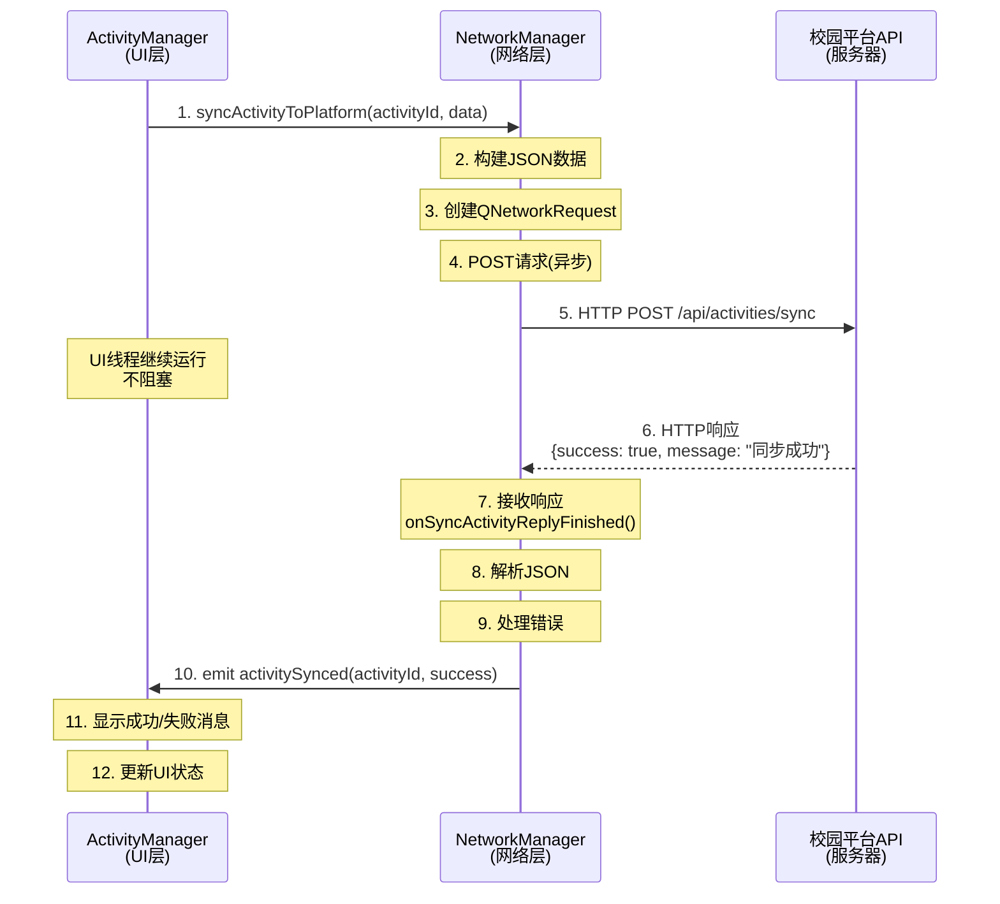
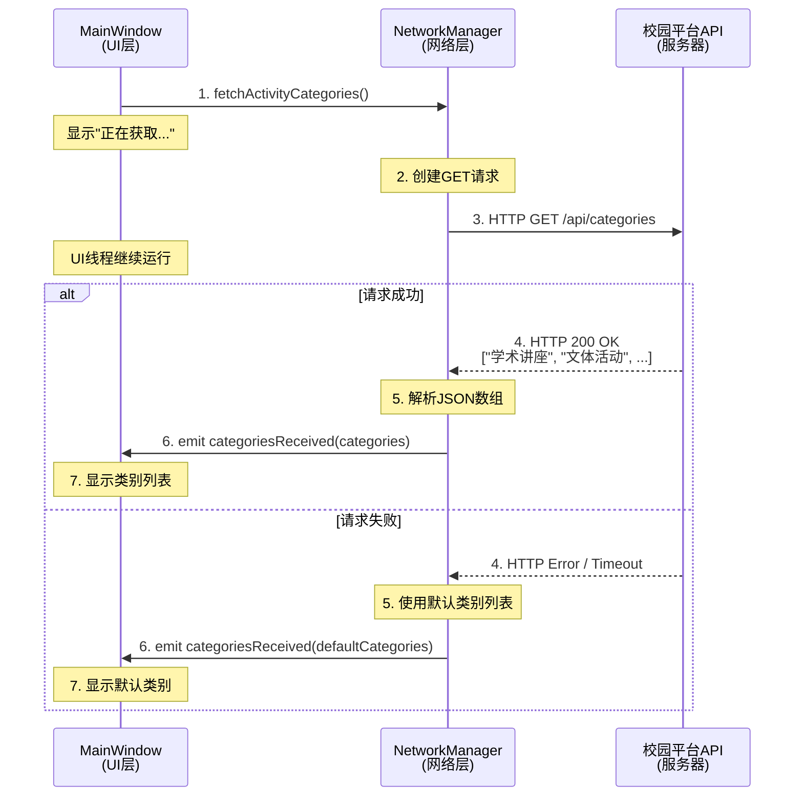
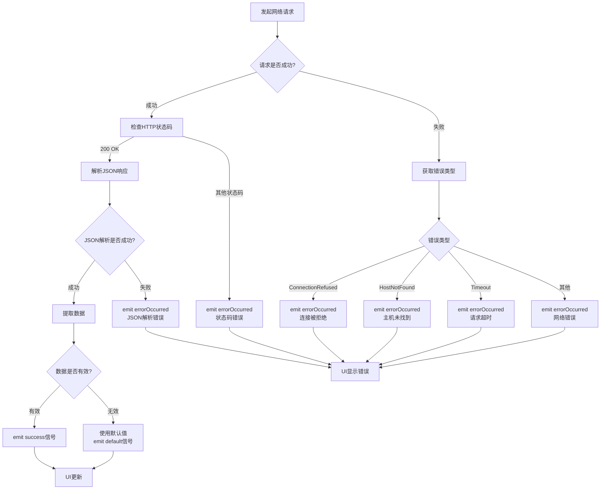
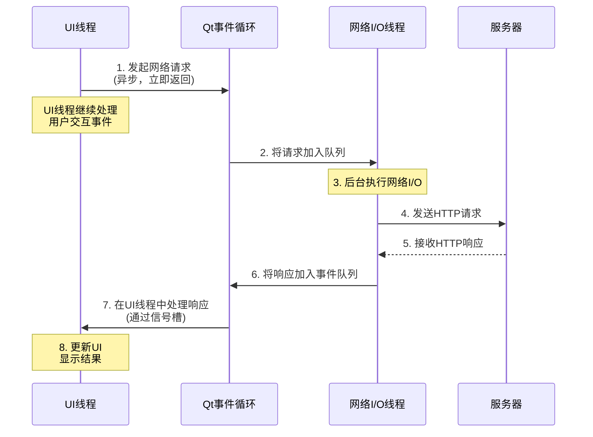
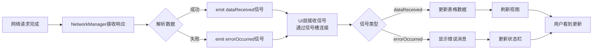

# 网络请求流程图（Mermaid格式）

## 活动同步流程图

```mermaid
sequenceDiagram
    participant UI as ActivityManager<br/>(UI层)
    participant NM as NetworkManager<br/>(网络层)
    participant API as 校园平台API<br/>(服务器)
    
    UI->>NM: 1. syncActivityToPlatform(activityId, data)
    Note over NM: 2. 构建JSON数据
    Note over NM: 3. 创建QNetworkRequest
    Note over NM: 4. POST请求(异步)
    NM->>API: 5. HTTP POST /api/activities/sync
    Note over UI: UI线程继续运行<br/>不阻塞
    
    API-->>NM: 6. HTTP响应<br/>{success: true, message: "同步成功"}
    
    Note over NM: 7. 接收响应<br/>onSyncActivityReplyFinished()
    Note over NM: 8. 解析JSON
    Note over NM: 9. 处理错误
    
    NM->>UI: 10. emit activitySynced(activityId, success)
    Note over UI: 11. 显示成功/失败消息
    Note over UI: 12. 更新UI状态
```

## 获取活动类别流程图

```mermaid
sequenceDiagram
    participant UI as MainWindow<br/>(UI层)
    participant NM as NetworkManager<br/>(网络层)
    participant API as 校园平台API<br/>(服务器)
    
    UI->>NM: 1. fetchActivityCategories()
    Note over UI: 显示"正在获取..."
    
    Note over NM: 2. 创建GET请求
    NM->>API: 3. HTTP GET /api/categories
    Note over UI: UI线程继续运行
    
    alt 请求成功
        API-->>NM: 4. HTTP 200 OK<br/>["学术讲座", "文体活动", ...]
        Note over NM: 5. 解析JSON数组
        NM->>UI: 6. emit categoriesReceived(categories)
        Note over UI: 7. 显示类别列表
    else 请求失败
        API-->>NM: 4. HTTP Error / Timeout
        Note over NM: 5. 使用默认类别列表
        NM->>UI: 6. emit categoriesReceived(defaultCategories)
        Note over UI: 7. 显示默认类别
    end
```

## 错误处理流程图

```mermaid
flowchart TD
    A[发起网络请求] --> B{请求是否成功?}
    
    B -->|成功| C[检查HTTP状态码]
    B -->|失败| D[获取错误类型]
    
    C -->|200 OK| E[解析JSON响应]
    C -->|其他状态码| F[emit errorOccurred<br/>状态码错误]
    
    E --> G{JSON解析是否成功?}
    G -->|成功| H[提取数据]
    G -->|失败| I[emit errorOccurred<br/>JSON解析错误]
    
    H --> J{数据是否有效?}
    J -->|有效| K[emit success信号]
    J -->|无效| L[使用默认值<br/>emit default信号]
    
    D --> M{错误类型}
    M -->|ConnectionRefused| N[emit errorOccurred<br/>连接被拒绝]
    M -->|HostNotFound| O[emit errorOccurred<br/>主机未找到]
    M -->|Timeout| P[emit errorOccurred<br/>请求超时]
    M -->|其他| Q[emit errorOccurred<br/>网络错误]
    
    K --> R[UI更新]
    L --> R
    F --> S[UI显示错误]
    I --> S
    N --> S
    O --> S
    P --> S
    Q --> S
```

## 异步请求避免阻塞UI的机制

```mermaid
sequenceDiagram
    participant UI as UI线程
    participant EventLoop as Qt事件循环
    participant Network as 网络I/O线程
    participant Server as 服务器
    
    UI->>EventLoop: 1. 发起网络请求<br/>(异步，立即返回)
    Note over UI: UI线程继续处理<br/>用户交互事件
    
    EventLoop->>Network: 2. 将请求加入队列
    Note over Network: 3. 后台执行网络I/O
    
    Network->>Server: 4. 发送HTTP请求
    Server-->>Network: 5. 接收HTTP响应
    
    Network->>EventLoop: 6. 将响应加入事件队列
    EventLoop->>UI: 7. 在UI线程中处理响应<br/>(通过信号槽)
    
    Note over UI: 8. 更新UI<br/>显示结果
```

## 数据更新UI的流程

```mermaid
flowchart LR
    A[网络请求完成] --> B[NetworkManager接收响应]
    B --> C{解析数据}
    C -->|成功| D[emit dataReceived信号]
    C -->|失败| E[emit errorOccurred信号]
    
    D --> F[UI层接收信号<br/>通过信号槽连接]
    E --> F
    
    F --> G{信号类型}
    G -->|dataReceived| H[更新表格数据]
    G -->|errorOccurred| I[显示错误消息]
    
    H --> J[刷新视图]
    I --> K[更新状态栏]
    
    J --> L[用户看到更新]
    K --> L
```
